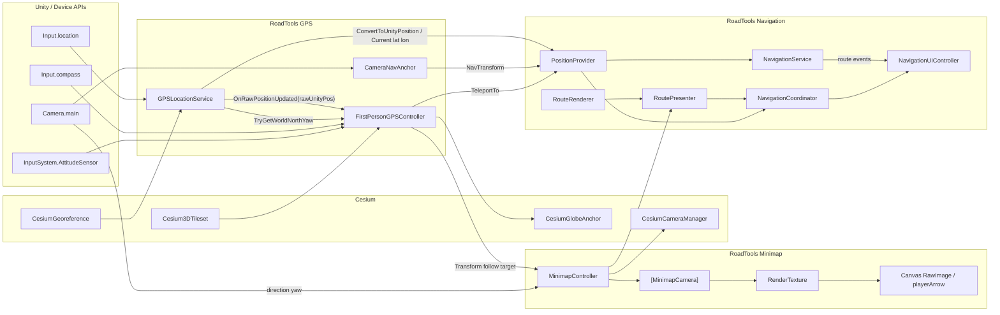
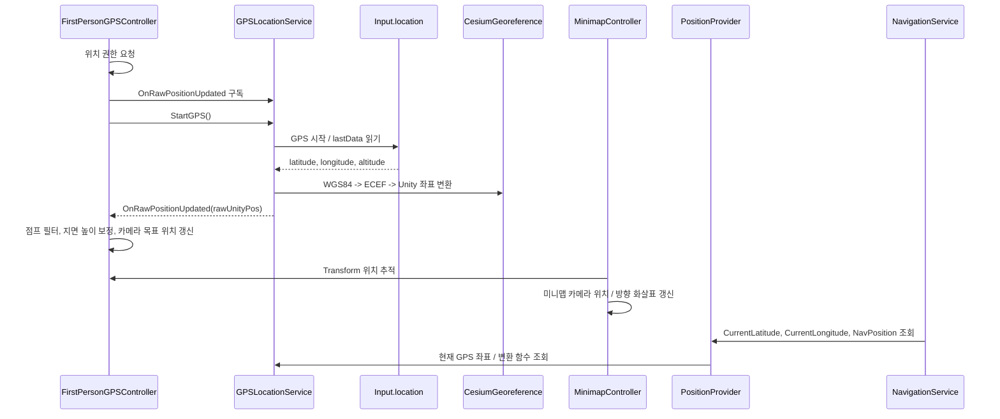
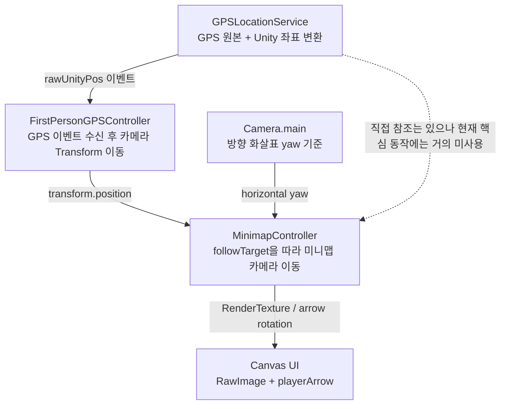
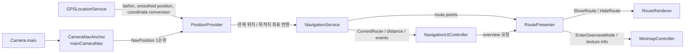

# RoadTools GPS / Minimap 의존성 지도

이 문서는 `Assets/RoadTools/Runtime` 기준으로 GPS, 1인칭 카메라, 미니맵, 내비게이션 레이어가 어떤 역할을 갖고 어떤 방향으로 의존하는지 정리합니다.

## 한 줄 요약

`GPSLocationService`가 실제 GPS와 Cesium 좌표 변환을 담당하고, `FirstPersonGPSController`가 그 위치를 카메라/플레이어 이동으로 바꿉니다. `MinimapController`는 GPS 값을 직접 따라가기보다 `FirstPersonGPSController` 또는 메인 카메라의 Transform을 따라가며, 내비게이션은 `PositionProvider`와 `RoutePresenter`를 통해 GPS/Minimap 기능을 간접 사용합니다.

## 컴포넌트 역할

| 컴포넌트 | 파일 | 핵심 역할 | 주요 출력/공개 API |
|---|---|---|---|
| `GPSLocationService` | `Assets/RoadTools/Runtime/GPS/GPSLocationService.cs` | Unity `Input.location` GPS 수신, WGS84 위도/경도/고도 -> Cesium/Unity 월드 좌표 변환, 위치 이벤트 발행 | `CurrentLatitude`, `CurrentLongitude`, `SmoothedUnityPosition`, `ConvertToUnityPosition()`, `TryGetWorldNorthYaw()`, `OnRawPositionUpdated` |
| `FirstPersonGPSController` | `Assets/RoadTools/Runtime/GPS/FirstPersonGPSController.cs` | 위치 권한 요청, GPS 시작, GPS 이벤트 구독, 1인칭 카메라 위치/방향 제어, 지면 높이 보정, 건물 충돌 보정 | `TeleportTo()`, `CurrentRotationMode`, `CycleRotationMode()`, 카메라 Transform |
| `CameraNavAnchor` | `Assets/RoadTools/Runtime/GPS/CameraNavAnchor.cs` | 메인 카메라 아래 지면 위치를 `mainCameraNav` Transform으로 유지 | `NavTransform` |
| `MinimapController` | `Assets/RoadTools/Runtime/Minimap/MinimapController.cs` | 미니맵 전용 정사영 카메라 생성, RenderTexture 생성, Canvas RawImage 연결, 플레이어 방향 화살표 갱신, 오버뷰 모드 제공 | `OverviewTexture`, `CurrentCamPosition`, `CurrentOrthoSize`, `EnterOverviewMode()`, `ExitOverviewMode()` |
| `PositionProvider` | `Assets/RoadTools/Runtime/Navigation/PositionProvider.cs` | GPS/카메라/앵커 위치를 내비게이션에서 쓰기 쉬운 위치 API로 래핑 | `CurrentLatitude`, `CurrentLongitude`, `PlayerPosition`, `NavPosition`, `ConvertToUnityPosition()`, `TeleportTo()` |
| `NavigationService` | `Assets/RoadTools/Runtime/Navigation/NavigationService.cs` | 목적지 설정, 현재 위치 기반 경로 계산, 도착 판정 | `OnRouteCalculated`, `SetDestination()`, `MoveToDestination()`, `DistanceToDestination` |
| `RoutePresenter` | `Assets/RoadTools/Runtime/Navigation/RoutePresenter.cs` | 경로 표시와 미니맵 오버뷰 제어를 묶어 제공 | `ShowRoute()`, `HideRoute()`, `TrimRoute()`, `EnterOverviewMode()` |
| `NavigationCoordinator` | `Assets/RoadTools/Runtime/Navigation/NavigationCoordinator.cs` | UI가 검색/위치/경로/미니맵 기능에 접근하는 단일 진입점 | `Search()`, `PlayerPosition`, `NavPosition`, `OverviewTexture`, `EnterOverviewMode()` |
| `NavigationUIController` | `Assets/RoadTools/Runtime/Navigation/NavigationUIController.cs` | 검색 UI, 경로 UI, 오버뷰 UI, 미니맵 좌표 변환 표시 | `NavigationCoordinator` 호출 |

## 의존성 그래프



## 런타임 위치 흐름



## Minimap이 GPS에 연결되는 방식



`MinimapController`에는 `_gpsService` 필드와 `ResolveGPSService()`가 있지만, 현재 코드에서 미니맵 카메라 위치나 화살표 방향은 GPS 값을 직접 읽어 결정하지 않습니다. 실제 미니맵 위치는 `_followTarget`이며, 기본값은 씬에서 찾은 `FirstPersonGPSController.transform`입니다. 방향 화살표는 `Camera.main.transform`의 수평 yaw를 기준으로 회전합니다.

## 내비게이션과의 연결



`PositionProvider.NavPosition`의 우선순위는 `CameraNavAnchor.NavTransform` -> `Camera.main.transform.position` -> `GPSLocationService.SmoothedUnityPosition`입니다. 즉 내비게이션 경로 시작점은 단순 GPS 좌표보다 "카메라 아래 지면 위치"를 우선 사용합니다.

## 책임 경계

| 경계 | 담당 | 다른 레이어가 기대하는 것 |
|---|---|---|
| GPS 수신/좌표 변환 | `GPSLocationService` | 최신 위도/경도/고도, Unity 월드 좌표, 북쪽 yaw |
| 플레이어 카메라 이동 | `FirstPersonGPSController` | GPS 이벤트를 받아 실제 카메라 Transform이 자연스럽게 이동함 |
| 내비게이션 기준점 | `CameraNavAnchor`, `PositionProvider` | 눈높이 카메라 위치가 아닌 지면 기준 시작점 제공 |
| 미니맵 렌더링 | `MinimapController` | 별도 카메라와 RenderTexture를 만들어 UI에 표시함 |
| 경로 계산/표시 | `NavigationService`, `RoutePresenter`, `RouteRenderer` | 현재 위치에서 목적지까지의 경로 산출과 LineRenderer 표시 |
| UI 진입점 | `NavigationCoordinator`, `NavigationUIController` | 검색, 경로, 미니맵 오버뷰를 한 곳에서 호출 |

## 핵심 결합 지점

1. `FirstPersonGPSController -> GPSLocationService`
   - 위치 권한 허용 후 `GPSLocationService.StartGPS()`를 호출합니다.
   - `GPSLocationService.OnRawPositionUpdated`를 구독해 카메라 목표 위치를 갱신합니다.
   - `TryGetWorldNorthYaw()`로 나침반/자이로 yaw를 월드 북쪽 기준으로 보정합니다.

2. `MinimapController -> FirstPersonGPSController`
   - `_followTarget`이 비어 있으면 `FindAnyObjectByType<FirstPersonGPSController>()`로 찾고 그 Transform을 따라갑니다.
   - 따라서 미니맵 위치는 `GPSLocationService.SmoothedUnityPosition`이 아니라 GPS 컨트롤러가 보정한 실제 카메라 Transform 기준입니다.

3. `MinimapController -> Camera.main`
   - `_directionTarget`이 비어 있으면 `Camera.main.transform`을 사용합니다.
   - 플레이어 화살표는 메인 카메라의 수평 yaw를 읽어 회전합니다.

4. `MinimapController -> CesiumCameraManager`
   - 런타임에 만든 `[MinimapCamera]`를 `CesiumCameraManager.additionalCameras`에 등록합니다.
   - Cesium 지형/타일이 미니맵 카메라에서도 정상 렌더링되도록 하는 연결입니다.

5. `PositionProvider -> GPSLocationService / CameraNavAnchor / FirstPersonGPSController`
   - GPS 좌표 조회와 좌표 변환은 `GPSLocationService`에 위임합니다.
   - 경로 시작 위치는 `CameraNavAnchor.NavTransform`을 우선 사용합니다.
   - 목적지로 즉시 이동하는 요청은 `FirstPersonGPSController.TeleportTo()`로 전달합니다.

6. `RoutePresenter -> MinimapController`
   - 일반 경로 표시는 `RouteRenderer`로 보냅니다.
   - 목적지 오버뷰는 `MinimapController.EnterOverviewMode()`로 위임합니다.

## 현재 구조에서 주의할 점

- `MinimapController._gpsService`는 현재 핵심 미니맵 동작에 직접 쓰이지 않습니다. 코드상 참조는 자동 검색까지 존재하지만 위치/방향 계산은 `_followTarget`과 `Camera.main` 중심입니다.
- `GPSLocationService.SmoothedUnityPosition`과 `FirstPersonGPSController.transform.position`은 같은 의미가 아닙니다. 전자는 GPS 좌표 변환/보간 결과이고, 후자는 지면 높이, 건물 보정, `CesiumGlobeAnchor` 이동이 반영된 플레이어 카메라 위치입니다.
- 내비게이션 시작점은 `PositionProvider.PlayerPosition`보다 `PositionProvider.NavPosition`이 더 중요합니다. 경로 계산은 카메라 아래 지면 투영점인 `mainCameraNav`를 우선 사용합니다.
- `FirstPersonGPSController`가 `MinimapController.MapSizeRatioConst`를 참조해 회전 모드 버튼 위치를 잡습니다. GPS 컨트롤러가 미니맵 UI 크기 상수에 의존하는 작은 역방향 결합이 있습니다.

## 단순화된 구조

```text
Device GPS
  -> GPSLocationService
      -> FirstPersonGPSController
          -> Camera / Player Transform
              -> MinimapController
                  -> [MinimapCamera] -> RenderTexture -> Canvas UI

Camera.main
  -> CameraNavAnchor(mainCameraNav)
      -> PositionProvider
          -> NavigationService
              -> RoutePresenter
                  -> RouteRenderer
                  -> MinimapController overview mode
```
