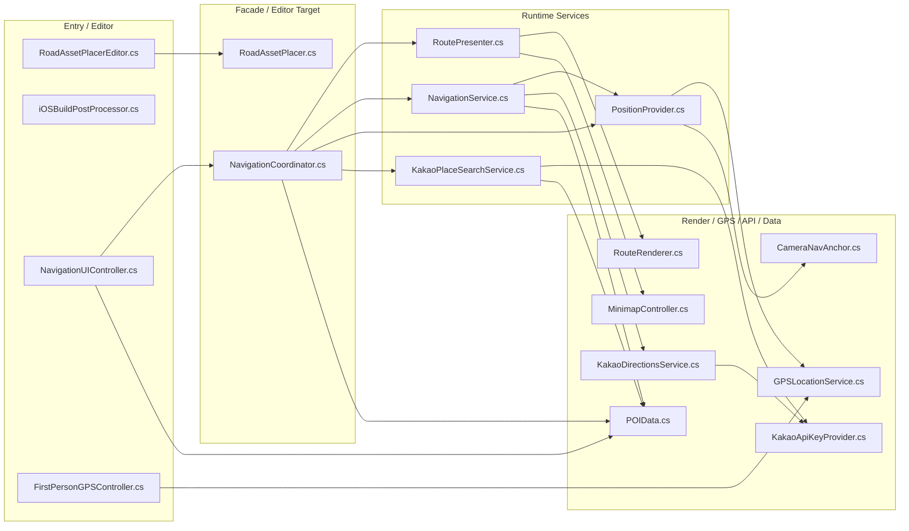

## 1. RoadTools C# 파일 내부 의존 관계 다이어그램

아래 다이어그램은 현재 `Assets/RoadTools` 아래의 `.cs` 파일만 대상으로 정리했다. 화살표 방향은 "앞 파일이 뒤 파일의 타입을 참조한다"는 의미이며, Unity/Cesium/Kakao/Editor API 같은 외부 패키지 의존성은 제외했다.

### 1.1 파일별 내부 의존 목록

| C# 파일 | RoadTools 내부 의존 |
|---|---|
| `Assets/RoadTools/Editor/RoadAssetPlacerEditor.cs` | `RoadAssetPlacer.cs` |
| `Assets/RoadTools/Editor/iOSBuildPostProcessor.cs` | 없음 |
| `Assets/RoadTools/Editor/RoadAssetPlacer/RoadAssetPlacer.cs` | 없음 |
| `Assets/RoadTools/Runtime/GPS/GPSLocationService.cs` | 없음 |
| `Assets/RoadTools/Runtime/GPS/FirstPersonGPSController.cs` | `GPSLocationService.cs` |
| `Assets/RoadTools/Runtime/GPS/CameraNavAnchor.cs` | 없음 |
| `Assets/RoadTools/Runtime/Minimap/MinimapController.cs` | 없음 |
| `Assets/RoadTools/Runtime/Navigation/NavigationUIController.cs` | `NavigationCoordinator.cs`, `POIData.cs` |
| `Assets/RoadTools/Runtime/Navigation/NavigationCoordinator.cs` | `NavigationService.cs`, `KakaoPlaceSearchService.cs`, `RoutePresenter.cs`, `PositionProvider.cs`, `POIData.cs` |
| `Assets/RoadTools/Runtime/Navigation/NavigationService.cs` | `PositionProvider.cs`, `KakaoDirectionsService.cs`, `POIData.cs` |
| `Assets/RoadTools/Runtime/Navigation/RoutePresenter.cs` | `RouteRenderer.cs`, `MinimapController.cs` |
| `Assets/RoadTools/Runtime/Navigation/RouteRenderer.cs` | 없음 |
| `Assets/RoadTools/Runtime/Navigation/PositionProvider.cs` | `GPSLocationService.cs`, `CameraNavAnchor.cs` |
| `Assets/RoadTools/Runtime/Navigation/POIData.cs` | 없음 |
| `Assets/RoadTools/Runtime/Navigation/KakaoApi/KakaoPlaceSearchService.cs` | `KakaoApiKeyProvider.cs`, `POIData.cs` |
| `Assets/RoadTools/Runtime/Navigation/KakaoApi/KakaoDirectionsService.cs` | `KakaoApiKeyProvider.cs` |
| `Assets/RoadTools/Runtime/Navigation/KakaoApi/KakaoApiKeyProvider.cs` | 없음 |

### 1.2 의존성 요약

- 총 대상 파일: 17개
- 내부 의존성이 없는 파일: `iOSBuildPostProcessor.cs`, `RoadAssetPlacer.cs`, `GPSLocationService.cs`, `CameraNavAnchor.cs`, `MinimapController.cs`, `RouteRenderer.cs`, `POIData.cs`, `KakaoApiKeyProvider.cs`
- `NavigationUIController.cs`는 이제 `NavigationService.cs`를 직접 참조하지 않고 `NavigationCoordinator.cs`만 통해 내비게이션 상태/명령/이벤트를 사용한다.
- `NavigationService.cs`는 `KakaoApiKeyProvider.cs`를 직접 참조하지 않고 `KakaoDirectionsService.cs`에 경로 요청을 위임한다.
- `FirstPersonGPSController.cs`는 `MinimapController.cs`를 직접 참조하지 않는다.
- `MinimapController.cs`는 `GPSLocationService.cs`나 `FirstPersonGPSController.cs`를 직접 참조하지 않고 `Transform`/`Camera.main` 기준으로 동작한다.
- 위치 읽기와 좌표 변환은 `PositionProvider.cs`가 `GPSLocationService.cs`, `CameraNavAnchor.cs`를 통해 하위 계층에서 받아 상위 내비게이션 계층에 제공한다.
- 검색과 경로 API는 `KakaoPlaceSearchService.cs`, `KakaoDirectionsService.cs`가 각각 `KakaoApiKeyProvider.cs`를 통해 REST API 키를 해결한다.
