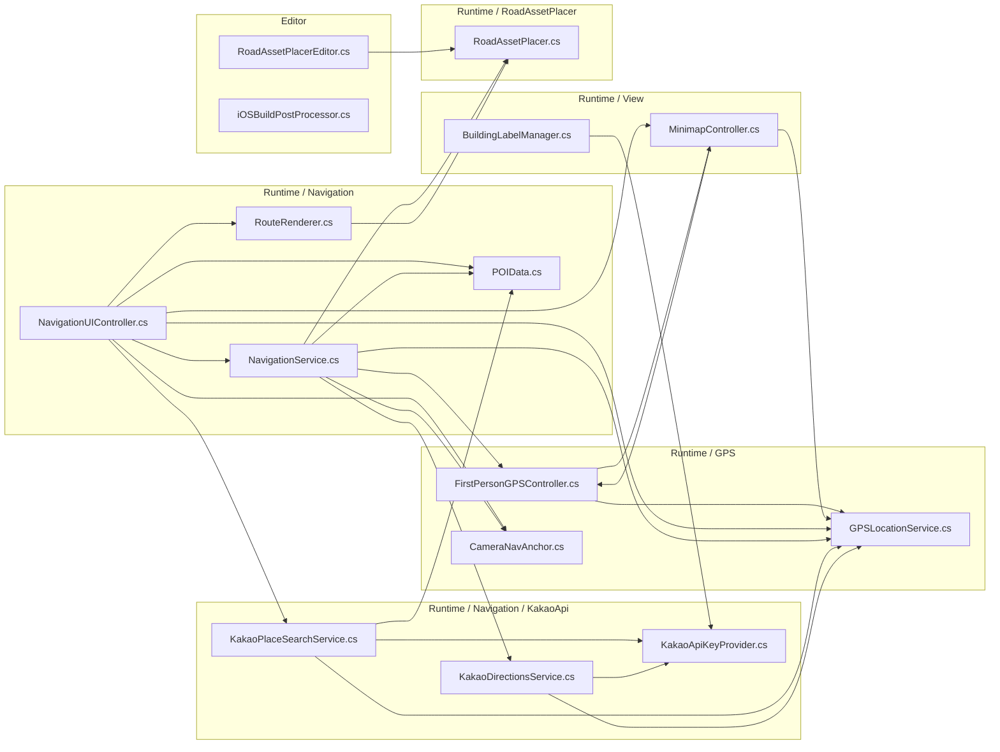

# Unity 3D Digital Twin 파이프라인 개요

대상 프로젝트: `C:/Users/rugem/cesium2/3D_Digital_twin`  
작성 기준: 실제 파일을 읽어 확인한 구조만 반영했다.

## 1. 확인한 범위

- 런타임 스크립트: `Assets/RoadTools/Runtime/`
- GPS 스크립트: `Assets/RoadTools/Runtime/GPS/`
- Navigation 스크립트: `Assets/RoadTools/Runtime/Navigation/`
- 씬: `Assets/level2.unity`
- 문서 생성 스크립트: `build_sprint_backlog.py`, `build_system_design.py`, `build_system_design_v2.py`
- 패키지/엔진 정보: `Packages/manifest.json`, `ProjectSettings/ProjectVersion.txt`

확인된 주요 패키지는 `com.cesium.unity` 1.23.1, `com.unity.ai.navigation` 2.0.12이다. Unity 에디터 버전은 `6000.4.1f1`로 기록되어 있다.

## 2. 런타임 전체 구성

```
Cesium ion / Kakao API / Device GPS
        |
        v
CesiumGeoreference + Cesium3DTileset
        |
        +--> GPSLocationService
        |       |
        |       +--> FirstPersonGPSController
        |       +--> NavigationService
        |       +--> KakaoPlaceSearchService / KakaoDirectionsService
        |
        +--> RoadAssetPlacer
        +--> BuildingLabelManager

NavigationUIController
        |
        +--> NavigationService
        +--> RouteRenderer
        +--> MinimapController
        +--> CameraNavAnchor
```

주요 네임스페이스는 `Rugem.RoadTools`이다. 어셈블리 정의 파일 `Assets/RoadTools/Runtime/Rugem.RoadTools.Runtime.asmdef`는 `Rugem.RoadTools.Runtime` 어셈블리를 정의하고, Cesium, AI Navigation, Input System, Mathematics 계열 참조 GUID를 포함한다.

## 3. Cesium for Unity 데이터 파이프라인

### 3.1 좌표 변환 파이프라인

코드 참조:

- `Assets/RoadTools/Runtime/GPS/GPSLocationService.cs`
  - `GPSLocationService.ConvertToUnityPosition(double latitude, double longitude, double altitude = 0.0)`
  - `GPSLocationService.ProcessLocationData(double lat, double lon, double alt)`
- `Assets/RoadTools/Runtime/RoadAssetPlacer.cs`
  - `RoadAssetPlacer.PlaceTreeLine(...)`
  - `RoadAssetPlacer.PlacePointAsset(...)`
- `Assets/RoadTools/Runtime/GPS/BuildingLabelManager.cs`
  - `BuildingLabelManager.UnityToLonLatHeight(Vector3 worldPos)`

흐름:

1. WGS84 좌표가 입력된다. 입력 순서는 코드상 위도, 경도, 고도이며 Cesium 변환 호출에는 `(longitude, latitude, altitude)` 순서로 전달된다.
2. `CesiumWgs84Ellipsoid.LongitudeLatitudeHeightToEarthCenteredEarthFixed()`가 WGS84를 ECEF 좌표로 변환한다.
3. `CesiumGeoreference.TransformEarthCenteredEarthFixedPositionToUnity()`가 ECEF를 Unity 월드 좌표 `Vector3`로 변환한다.
4. `GPSLocationService.ProcessLocationData()`는 변환 결과를 `TargetUnityPosition`에 저장하고 첫 수신이면 `SmoothedUnityPosition`도 즉시 동기화한다.
5. `GPSLocationService.Update()`는 `Vector3.Lerp()`로 `SmoothedUnityPosition`을 `TargetUnityPosition` 쪽으로 보간한다.

역방향 변환은 `BuildingLabelManager.UnityToLonLatHeight()`에서 확인된다.

```
WGS84(lat, lon, alt)
  -> CesiumWgs84Ellipsoid.LongitudeLatitudeHeightToEarthCenteredEarthFixed()
  -> ECEF
  -> CesiumGeoreference.TransformEarthCenteredEarthFixedPositionToUnity()
  -> Unity Vector3
```

### 3.2 Cesium 타일셋/지형 구성

`Assets/level2.unity`에서 확인된 Cesium 오브젝트:

- `CesiumGeoreference`
  - `CesiumForUnity.CesiumGeoreference`
  - `CesiumForUnity.CesiumCameraManager`
  - 원점 값: latitude `36.36235939207394`, longitude `127.34405167665527`, height `198.58942199942413`
- `Cesium World Terrain`
  - `CesiumForUnity.Cesium3DTileset`
  - `_ionAssetID: 1`
  - `CesiumForUnity.CesiumIonRasterOverlay`
  - `_ionAssetID: 3830184`
  - 레이어: `7`
- `dorohe`
  - `Unity.AI.Navigation.NavMeshSurface`
  - `CesiumForUnity.Cesium3DTileset`
  - `_ionAssetID: 4609071`
  - `_createPhysicsMeshes: 1`
  - `m_NavMeshData`가 `Assets/NavMesh-dorohe 1.asset` GUID를 참조
- `output_folder`
  - `CesiumForUnity.Cesium3DTileset`
  - `_ionAssetID: 4545115`

지형 높이 사용 흐름:

1. `FirstPersonGPSController.SampleAndUpdateGroundHeight()`가 `_worldTerrain.SampleHeightMostDetailed(new double3(lon, lat, 0.0))`를 호출한다.
2. 성공하면 반환 고도를 `GPSLocationService.ConvertToUnityPosition()`으로 Unity 좌표로 바꾼 뒤 Y 값을 지면 높이 캐시로 사용한다.
3. 실패하면 `FirstPersonGPSController.TryGetGroundHeightRaycast()`가 Physics Raycast로 지면 Y를 찾는다.
4. 최종 카메라 목표 Y는 지면 Y + `_eyeHeight`이다.

## 4. GPS/권한/1인칭 카메라 워크플로우

코드 참조:

- `Assets/RoadTools/Runtime/GPS/LocationPermissionHandler.cs`
  - `CheckAndRequestPermission()`
  - `HandlePermissionGranted()`
  - `HandlePermissionDenied()`
- `Assets/RoadTools/Runtime/GPS/GPSLocationService.cs`
  - `StartGPS()`
  - `GPSUpdateLoop()`
  - `ConvertToUnityPosition(...)`
- `Assets/RoadTools/Runtime/GPS/FirstPersonGPSController.cs`
  - `StartGPSTracking()`
  - `OnGPSPositionUpdated(Vector3 rawUnityPosition)`
  - `SampleAndUpdateGroundHeight(...)`
  - `UpdateRotation()`
  - `TeleportTo(double latitude, double longitude)`

단계별 흐름:

1. `LocationPermissionHandler.Start()`가 버튼 리스너를 등록하고 `CheckAndRequestPermission()`을 호출한다.
2. Android에서는 `Permission.FineLocation` 권한을 확인/요청한다.
3. iOS에서는 `Input.location.Start()` 후 상태를 확인하는 `CheckiOSPermission()` 코루틴을 사용한다.
4. 에디터/기타 플랫폼에서는 바로 권한 허용으로 처리한다.
5. 권한 허용 시 `OnPermissionGranted` 이벤트가 발생한다.
6. `FirstPersonGPSController.Start()`는 `LocationPermissionHandler.OnPermissionGranted`를 구독하고, 허용 상태이면 `StartGPSTracking()`을 호출한다.
7. `StartGPSTracking()`은 `GPSLocationService.OnRawPositionUpdated`에 `OnGPSPositionUpdated()`를 연결하고 `GPSLocationService.StartGPS()`를 호출한다.
8. `GPSLocationService.GPSUpdateLoop()`가 플랫폼별 GPS 데이터를 읽는다. 에디터에서는 `CesiumGeoreference`의 latitude/longitude를 시뮬레이션 값으로 사용한다.
9. GPS 좌표는 `ConvertToUnityPosition()`을 거쳐 Unity 좌표로 변환되고 `OnRawPositionUpdated`로 전달된다.
10. `FirstPersonGPSController.OnGPSPositionUpdated()`는 XZ를 반영하고, 지면 높이 캐시가 없거나 XZ 이동량이 2m를 넘으면 `SampleAndUpdateGroundHeight()`를 실행한다.
11. `FirstPersonGPSController.Update()`는 목표 위치로 보간하고 `CesiumGlobeAnchor.transform.position`을 갱신한다.
12. `UpdateRotation()`은 `RotationMode.Gyro`, `RotationMode.Locked`, `RotationMode.Drag` 상태에 따라 카메라 회전을 갱신한다.

```
권한 확인
  -> GPS 시작
  -> WGS84 수신
  -> Cesium 좌표 변환
  -> 지면 높이 샘플링 또는 Raycast
  -> 카메라 목표 위치 계산
  -> CesiumGlobeAnchor 위치 갱신
```

건물 충돌 보정은 `FirstPersonGPSController.HandleBuildingCollision()`에서 처리한다. `_buildingLayerMask`가 설정된 경우 0.2초 간격으로 `IsInsideBuilding()`을 확인하고, 건물 내부로 판단되면 `FindNearestRoadXZ()`로 가까운 도로/개방 위치를 찾아 XZ를 고정한다.

## 5. 내비게이션/검색/경로 표시 워크플로우

코드 참조:

- `Assets/RoadTools/Runtime/Navigation/NavigationUIController.cs`
  - `OpenSearch()`
  - `StartKakaoSearch()`
  - `SelectDestination(POIData poi)`
  - `HandleRouteCalculated(POIData poi, Vector3[] route)`
  - `HandleArrived()`
- `Assets/RoadTools/Runtime/Navigation/KakaoPlaceSearchService.cs`
  - `Search(string query, Action<List<POIData>, string> onComplete)`
  - `SearchCoroutine(...)`
  - `ParseDocuments(...)`
- `Assets/RoadTools/Runtime/Navigation/NavigationService.cs`
  - `SetDestination(POIData poi)`
  - `CalculateRoute()`
  - `CalculateNavMeshRoute()`
  - `TryCalculateNavMeshRoute(...)`
  - `TryCalculateRoadMeshRoute(...)`
  - `MoveToDestination()`
  - `ClearNavigation()`
- `Assets/RoadTools/Runtime/Navigation/KakaoDirectionsService.cs`
  - `RequestRoute(...)`
  - `RequestCoroutine(...)`
  - `ParseWaypoints(...)`
- `Assets/RoadTools/Runtime/Navigation/RouteRenderer.cs`
  - `ShowRoute(Vector3[] waypoints)`
  - `TrimFromPlayerPosition(Vector3 playerWorldPos)`
  - `ProjectOnNavMeshAndTerrain(Vector3[] waypoints)`

UI 상태 흐름:

```
None
  -> SearchOpen
  -> MapOverview
  -> Navigating
  -> Arrived
  -> None
```

검색/목적지 설정 흐름:

1. `NavigationUIController.OnGUI()`가 상태별 UI를 그린다.
2. `None` 상태에서 검색 버튼을 누르면 `OpenSearch()`가 `SearchOpen`으로 전환하고 최근 검색을 `PlayerPrefs`에서 읽는다.
3. 사용자가 검색어를 입력하면 `StartKakaoSearch()`가 `KakaoPlaceSearchService.Search()`를 호출한다.
4. `KakaoPlaceSearchService.SearchCoroutine()`은 `https://dapi.kakao.com/v2/local/search/keyword.json`에 REST 요청을 보낸다.
5. 응답은 `ParseDocuments()`에서 `POIData` 목록으로 변환된다.
6. 검색 결과 항목을 선택하면 `NavigationUIController.SelectDestination()`이 실행된다.
7. `SelectDestination()`은 최근 검색에 추가하고 `NavigationService.SetDestination()`을 호출한다.
8. `NavigationService.SetDestination()`은 목적지 WGS84 좌표를 Unity 월드 좌표로 변환하고 `CalculateRoute()`를 호출한다.

경로 계산 우선순위:

1. `KakaoDirectionsService`가 연결되어 있으면 `KakaoDirectionsService.RequestRoute()`를 먼저 사용한다.
2. Directions 응답이 성공하면 `ParseWaypoints()`가 Kakao vertexes 배열을 Unity 좌표 배열로 변환한다.
3. 실패하거나 Directions 서비스가 없으면 `CalculateNavMeshRoute()`를 사용한다.
4. `TryCalculateNavMeshRoute()`가 Unity `NavMesh.SamplePosition()`과 `NavMesh.CalculatePath()`로 경로를 찾는다.
5. NavMesh 경로가 실패하면 `TryCalculateRoadMeshRoute()`가 `_roadLayerMask`에 대해 Raycast 기반 도로 그리드를 만들고 A* 탐색(`FindRoadGridPath`)을 수행한다.
6. 모두 실패하면 시작점과 목적지를 잇는 직선 경로를 `CurrentRoute`로 사용한다.

```
목적지 선택
  -> Kakao Directions 시도
      -> 성공: Kakao waypoints 사용
      -> 실패: NavMesh 경로 계산
          -> 실패: Road 레이어 Raycast 그리드 A*
              -> 실패: 직선 경로
  -> OnRouteCalculated 이벤트
  -> RouteRenderer.ShowRoute()
```

경로 렌더링:

1. `NavigationService.OnRouteCalculated` 이벤트를 `NavigationUIController.HandleRouteCalculated()`가 받는다.
2. `RouteRenderer.ShowRoute()`가 경로를 `ProjectOnNavMeshAndTerrain()`에 전달한다.
3. `ProjectOnNavMeshAndTerrain()`은 구간을 `_terrainSampleStep` 간격으로 보간하고 `SnapToRoadSurface()`로 각 점을 도로/지형 표면에 투영한다.
4. `DrawLine()`이 `LineRenderer`에 좌표를 설정한다.
5. 목적지에는 런타임 생성 구체 `[NavDestinationMarker]`가 표시된다.
6. 주행 중에는 `NavigationUIController.Update()`가 `RouteRenderer.TrimFromPlayerPosition()`을 호출해 현재 위치 앞쪽 경로만 다시 그린다.

도착 판정:

1. `NavigationService.Update()`가 내비게이션 중 `UpdateDistance()`와 `CheckArrival()`을 호출한다.
2. `DistanceToDestination`이 `_arrivalRadius`보다 작으면 `OnArrived` 이벤트를 발생시키고 `IsNavigating`을 false로 바꾼다.
3. `NavigationUIController.HandleArrived()`가 경로를 숨기고 `Arrived` 상태로 전환한다.

## 6. 미니맵/카메라 기준점 워크플로우

코드 참조:

- `Assets/RoadTools/Runtime/GPS/MinimapController.cs`
  - `CreateMinimapCamera()`
  - `LateUpdate()`
  - `EnterOverviewMode(Vector3 playerWorldPos, Vector3 destWorldPos)`
  - `ExitOverviewMode()`
  - `OnGUI()`
- `Assets/RoadTools/Runtime/GPS/CameraNavAnchor.cs`
  - `Awake()`
  - `LateUpdate()`
  - `SampleGroundBelow(Vector3 camPos)`

미니맵 흐름:

1. `MinimapController.Start()`가 `CreateMinimapCamera()`를 호출한다.
2. 런타임에 `[MinimapCamera]` GameObject를 생성하고 orthographic Camera를 붙인다.
3. `RenderTexture`를 생성하여 미니맵 카메라의 `targetTexture`로 설정한다.
4. `CesiumCameraManager`가 있으면 `additionalCameras`에 미니맵 카메라를 등록한다.
5. 일반 모드에서는 `LateUpdate()`가 `_followTarget` 위치 위로 미니맵 카메라를 이동한다.
6. `OnGUI()`가 화면 오른쪽 상단에 RenderTexture와 방향 마커를 그린다.
7. `EnterOverviewMode()`는 플레이어/목적지 중점을 기준으로 카메라를 이동하고 orthographic size를 조정한다.

카메라 기준점 흐름:

1. `CameraNavAnchor.Awake()`는 자식 `mainCameraNav`가 있으면 사용하고 없으면 생성한다.
2. `LateUpdate()`마다 `Camera.main` 아래 방향으로 Raycast를 쏜다.
3. Raycast 성공 시 지면 표면 위치를 `NavTransform.position`에 저장한다.
4. `NavigationService.CalculateNavMeshRoute()`와 `NavigationUIController.Update()`는 이 지점이 있으면 경로 시작점/트리밍 기준으로 사용한다.

## 7. 건물 이름 라벨 워크플로우

코드 참조:

- `Assets/RoadTools/Runtime/GPS/BuildingLabelManager.cs`
  - `Update()`
  - `ScanViewport()`
  - `FetchBuildingName((int, int) key, double lat, double lon)`
  - `ToGpsKey(Vector3 worldPos)`
  - `UnityToLonLatHeight(Vector3 worldPos)`
  - `OnGUI()`

흐름:

1. `Update()`가 `_checkInterval`마다 `ScanViewport()` 코루틴을 시작한다.
2. `ScanViewport()`는 화면을 `_gridSize x _gridSize` 격자로 나누고 각 격자 중심에서 Raycast를 수행한다.
3. 충돌점 Y가 지면 기준 + `_buildingMinHeight` 이상이면 건물 후보로 간주한다.
4. 충돌점 Unity 좌표를 `UnityToLonLatHeight()`로 WGS84 좌표로 변환한다.
5. `ToGpsKey()`가 좌표를 `_gpsQuantizeScale` 단위로 양자화해 캐시 키를 만든다.
6. 캐시에 없으면 `FetchBuildingName()`이 Kakao coord2address API `https://dapi.kakao.com/v2/local/geo/coord2address.json`로 요청한다.
7. 응답의 `road_address.building_name` 값을 캐시에 저장한다.
8. `OnGUI()`는 카메라 가시 영역과 `_labelMaxDistance` 조건을 통과한 라벨을 화면에 그린다.

## 8. 도로/시설물 배치 및 NavMesh 워크플로우

코드 참조:

- `Assets/RoadTools/Runtime/RoadAssetPlacer.cs`
  - `GetOrCreateTypeGroup(string typeName)`
  - `SetTypeVisible(string typeName, bool visible)`
  - `DetachMeshes(Transform container, Action<GameObject> onCreated = null)`
  - `BuildNavMesh()`
  - `PlaceTreeLine(...)`
  - `PlacePointAsset(double latitude, double longitude, Transform parent = null)`
  - `ClearAllAssets()`

타입 그룹 관리:

1. `GetOrCreateTypeGroup()`은 `[Type] {typeName}` 자식 GameObject를 만들거나 기존 그룹을 반환한다.
2. `SetTypeVisible()`은 타입 그룹 GameObject의 active 상태를 바꾼다.
3. `GetAllTypeNames()`는 현재 생성된 타입 그룹 이름 목록을 반환한다.

NavMesh 빌드:

1. `BuildNavMesh()`는 현재 GameObject에 `NavMeshSurface`가 없으면 추가한다.
2. `collectObjects`를 `CollectObjects.Children`로 설정한다.
3. `layerMask`를 `roadLayerMask`로 설정한다.
4. `BuildNavMesh()`를 호출한다.

선형 시설물 배치:

1. `PlaceTreeLine()`이 시작/종료 WGS84 좌표를 입력받는다.
2. 각 좌표를 Cesium ECEF 변환 후 Unity 좌표로 변환한다.
3. `NavMesh.SamplePosition()`으로 시작/종료 지점을 NavMesh 위로 스냅한다.
4. `NavMesh.CalculatePath()`로 경로를 계산한다.
5. 경로 corner 구간을 `treeInterval` 간격으로 샘플링한다.
6. 각 샘플 위치에서 아래 방향 Raycast를 `roadLayerMask`로 수행한다.
7. 성공 지점에 `assetPrefab`을 Instantiate하고 `CesiumGlobeAnchor`를 추가한다.
8. `disableShadows`가 true이면 하위 Renderer의 shadow casting을 끈다.
9. `applyStaticBatching`이 true이면 `StaticBatchingUtility.Combine(lineParent)`를 호출한다.

점 시설물 배치:

1. `PlacePointAsset()`이 WGS84 좌표 하나를 입력받는다.
2. Cesium 변환으로 Unity 좌표를 만든다.
3. 해당 XZ 위치 위에서 Raycast로 실제 지면을 찾는다.
4. 성공하면 prefab을 배치하고 `CesiumGlobeAnchor`를 추가한다.

## 9. 모바일 입력 및 Cesium Credit 처리

코드 참조:

- `Assets/RoadTools/Runtime/GPS/MobileInputSetup.cs`
  - `Awake()`
  - `OnDestroy()`
- `Assets/RoadTools/Runtime/GPS/CesiumCreditReducer.cs`
  - `Start()`
  - `Apply()`
  - `FindCreditDocument()`
  - `SetPickingModeRecursive(VisualElement root, PickingMode mode)`

`MobileInputSetup`은 `ENABLE_INPUT_SYSTEM`이 정의된 경우 `EnhancedTouchSupport.Enable()`을 호출하고, 파괴 시 Disable한다.

`CesiumCreditReducer`는 2프레임 대기 후 3초마다 `Apply()`를 실행한다. `UIDocument`에서 `OnScreenCredits` VisualElement를 찾고, root 하위 전체의 `pickingMode`를 `Ignore`로 설정한다. `_fontSize <= 0`이면 credit 표시를 숨기고, 아니면 font size를 조정한다.

## 10. level2.unity 씬 레벨 구성

`Assets/level2.unity`에서 확인된 주요 GameObject와 컴포넌트:

| GameObject | 확인된 주요 컴포넌트/설정 |
|---|---|
| `navUI` | `RoadAssetPlacer`, `RouteRenderer`, `LineRenderer`, `NavigationUIController`, `NavigationService`, `KakaoPlaceSearchService` |
| `Main Camera` | `Camera`, `FirstPersonGPSController`, `CesiumOriginShift`, `CesiumGlobeAnchor`, `CesiumCameraController`, `CesiumCreditReducer`, `CameraNavAnchor` |
| `building nameTag Manager` | `BuildingLabelManager` |
| `CesiumGeoreference` | `CesiumCameraManager`, `CesiumGeoreference` |
| `dorohe` | `NavMeshSurface`, `Cesium3DTileset` |
| `gpsm minimap` | `RoadAssetPlacer`, `LocationPermissionHandler`, `GPSLocationService`, `MinimapController` |
| `Cesium World Terrain` | `CesiumIonRasterOverlay`, `Cesium3DTileset` |
| `output_folder` | `Cesium3DTileset` |

중요 연결:

- `navUI.NavigationUIController`
  - `_navService` -> 같은 GameObject의 `NavigationService`
  - `_routeRenderer` -> 같은 GameObject의 `RouteRenderer`
  - `_gpsService` -> `gpsm minimap`의 `GPSLocationService`
  - `_kakaoSearch` -> 같은 GameObject의 `KakaoPlaceSearchService`
  - `_minimapController` -> `gpsm minimap`의 `MinimapController`
  - `_navAnchor` -> `Main Camera`의 `CameraNavAnchor`
- `navUI.NavigationService`
  - `_gpsService` -> `gpsm minimap`의 `GPSLocationService`
  - `_playerController` -> `Main Camera`의 `FirstPersonGPSController`
  - `_navAnchor` -> `Main Camera`의 `CameraNavAnchor`
  - `_directionsService` -> 미연결 `{fileID: 0}`
- `Main Camera.FirstPersonGPSController`
  - `_gpsService` -> `gpsm minimap`의 `GPSLocationService`
  - `_permissionHandler` -> `gpsm minimap`의 `LocationPermissionHandler`
  - `_worldTerrain` -> `Cesium World Terrain`의 `Cesium3DTileset`
- `gpsm minimap.GPSLocationService`
  - `_georeference` -> `CesiumGeoreference`의 `CesiumGeoreference`
- `gpsm minimap.MinimapController`
  - `_followTarget` -> `Main Camera` Transform
- `building nameTag Manager.BuildingLabelManager`
  - `_georeference` -> `CesiumGeoreference`의 `CesiumGeoreference`

레이어 마스크 값은 씬 직렬화 기준으로 다음처럼 사용된다.

- Road 계열로 보이는 마스크: `m_Bits: 64`
- 지형/지면 계열로 보이는 마스크: `m_Bits: 128`
- 건물 계열로 보이는 마스크: `m_Bits: 256`

레이어 이름 자체는 `level2.unity` 직렬화 구간만으로 확정하지 않았다.

## 11. 빌드/문서 생성 파이프라인

실제 `build_*.py` 파일은 Unity 플레이어 빌드 스크립트가 아니라 `.docx` 문서 생성 스크립트다. 세 스크립트 모두 `python-docx`의 `Document`를 사용한다.

### 11.1 Sprint Backlog 문서 생성

파일: `build_sprint_backlog.py`

확인된 함수:

- `shd(cell, hex_color)`
- `set_col_width(table, col_idx, width_cm)`
- `header_row(table, headers, bg='4472C4', fg='FFFFFF')`
- `data_rows(table, rows, alt='D9E2F3')`
- `task_section(doc, heading, tasks)`

흐름:

1. 표 셀 음영, 컬럼 너비, 헤더/데이터 행 생성을 위한 헬퍼 함수를 정의한다.
2. `[양식 6-2] Sprint Backlog 양식 (1).docx` 템플릿을 `Sprint_Backlog_Sprint1_완성.docx`로 복사한다.
3. `Document("Sprint_Backlog_Sprint1_완성.docx")`로 문서를 연다.
4. 기존 문서 본문 일부를 제거한다.
5. Sprint Goal, Selected User Stories, Task Breakdown, Definition of Done Mapping 섹션을 추가한다.
6. `doc.save("Sprint_Backlog_Sprint1_완성.docx")`로 저장한다.

### 11.2 시스템 구조 설계 문서 생성

파일: `build_system_design.py`

확인된 함수:

- `add_paragraph(...)`
- `add_heading(text, level=1)`
- `add_table(headers, rows, col_widths=None)`

흐름:

1. `[양식 5] 시스템 구조 설계 및 개발 환경 양식.docx` 템플릿을 `[양식 5] 시스템 구조 설계 및 개발 환경 완성.docx`로 복사한다.
2. 복사본을 `Document(OUTPUT)`으로 연다.
3. 기존 paragraph/table 요소를 제거한다.
4. 문단, 제목, 표 생성을 위한 헬퍼를 사용한다.
5. 문서 이력, 메타 정보, 프로젝트 개요, 아키텍처 설계, 핵심 업무 흐름, 데이터 설계, 향후 개발 요소, 개발 환경, 요구사항 추적 섹션을 작성한다.
6. `doc.save(OUTPUT)`로 저장하고 저장 완료 메시지를 출력한다.

### 11.3 시스템 구조 설계 v2 문서 생성

파일: `build_system_design_v2.py`

확인된 함수:

- `p_add(...)`
- `heading(text, level=1)`
- `shade_cell(cell, hex_color="D9E1F2")`
- `table(headers, rows, col_widths=None, header_color="D9E1F2")`

흐름:

1. `[양식 5] 시스템 구조 설계 및 개발 환경 양식.docx` 템플릿을 `[양식 5] 시스템 구조 설계 및 개발 환경 완성_v2.docx`로 복사한다.
2. 복사본을 `Document(OUTPUT)`으로 연다.
3. 기존 paragraph/table 요소를 제거한다.
4. 문단, 제목, 음영, 표 생성을 위한 헬퍼를 사용한다.
5. 프로젝트/시스템 설계 내용을 다시 구성한다.
6. `doc.save(OUTPUT)`로 저장하고 저장 완료 메시지를 출력한다.

## 12. 주요 런타임 이벤트/데이터 연결 요약

```
LocationPermissionHandler.OnPermissionGranted
  -> FirstPersonGPSController.StartGPSTracking()
      -> GPSLocationService.StartGPS()
          -> GPSLocationService.OnRawPositionUpdated
              -> FirstPersonGPSController.OnGPSPositionUpdated()
```

```
NavigationUIController.SelectDestination()
  -> NavigationService.SetDestination()
      -> NavigationService.CalculateRoute()
          -> NavigationService.OnRouteCalculated
              -> NavigationUIController.HandleRouteCalculated()
                  -> RouteRenderer.ShowRoute()
```

```
NavigationService.Update()
  -> UpdateDistance()
  -> CheckArrival()
      -> NavigationService.OnArrived
          -> NavigationUIController.HandleArrived()
              -> RouteRenderer.HideRoute()
```

```
MinimapController.EnterOverviewMode()
  <- NavigationUIController.SelectDestination()
  -> RenderTexture 기반 overview 지도 표시
```

## 13. 실제 코드 기준 특이사항

- `NavigationService._directionsService`는 `level2.unity`에서 연결되어 있지 않다. 따라서 현재 씬 직렬화 기준으로는 Kakao Directions 경로가 아니라 NavMesh/도로 메쉬/직선 fallback 흐름이 사용된다.
- `KakaoPlaceSearchService`와 `BuildingLabelManager`에는 `_restApiKey` 값이 씬에 직렬화되어 있다.
- `KakaoDirectionsService.cs` 파일은 존재하지만 `level2.unity`에서 해당 컴포넌트 인스턴스는 확인되지 않았다.
- `MobileInputSetup.cs` 파일은 존재하지만 `level2.unity`의 주요 검색 결과에서는 해당 컴포넌트가 확인되지 않았다.
- `RoadAssetPlacer`는 `navUI`와 `gpsm minimap` 양쪽에 붙어 있다. `navUI` 쪽은 `assetPrefab`이 연결되어 있고, `gpsm minimap` 쪽은 `assetPrefab`이 `{fileID: 0}`이다.
- 소스 파일의 일부 한글 주석/문자열은 현재 읽기 결과에서 인코딩이 깨져 보였지만, 클래스명/메서드명/로직은 C# 구문 기준으로 확인했다.

## 14. 주요 기능별 Inspector 종류, 기능, 상호작용

이 섹션은 기존 분석 내용에 추가한 Inspector 중심 요약이다. 기준은 `Assets/RoadTools/Runtime/`의 `[SerializeField]`, `public` 필드, `Header` 속성, 그리고 `Assets/level2.unity`에 직렬화된 컴포넌트 연결이다.

### 14.1 Inspector 종류 요약

| Inspector 종류 | 대표 컴포넌트 | 주요 기능 | 씬 배치 확인 |
|---|---|---|---|
| 좌표/지리 참조 Inspector | `CesiumGeoreference`, `GPSLocationService` | WGS84/ECEF/Unity 좌표 변환 기준 제공, GPS 위치 수신값을 Unity 좌표로 변환 | `CesiumGeoreference`, `gpsm minimap` |
| Cesium 타일셋 Inspector | `Cesium3DTileset`, `CesiumIonRasterOverlay` | Cesium ion 지형/3D Tiles/래스터 오버레이 로드, 물리 메시 생성 설정 | `Cesium World Terrain`, `dorohe`, `output_folder` |
| 위치 권한 Inspector | `LocationPermissionHandler` | Android/iOS 위치 권한 요청, 거부 UI 버튼 연결 | `gpsm minimap` |
| 1인칭 카메라 Inspector | `FirstPersonGPSController` | GPS 기반 카메라 위치 동기화, 지면 높이 보정, 회전 모드, 건물 충돌 보정 | `Main Camera` |
| 내비게이션 서비스 Inspector | `NavigationService` | 목적지 설정, 경로 계산, 도착 판정, Kakao Directions/NavMesh/Road fallback 연결 | `navUI` |
| 내비게이션 UI Inspector | `NavigationUIController` | 검색 UI, 지도 overview, 주행 바, 도착 overlay, 이벤트 구독 | `navUI` |
| Kakao 검색 Inspector | `KakaoPlaceSearchService` | 키워드 장소 검색, 검색 반경/페이지/타임아웃/API 키 설정 | `navUI` |
| Kakao 길찾기 Inspector | `KakaoDirectionsService` | Kakao Mobility Directions API 경로 요청 | 파일 존재, `level2.unity` 인스턴스 미확인 |
| 경로 렌더링 Inspector | `RouteRenderer`, `LineRenderer` | 경로 선 색/두께/지면 투영/목적지 마커 표시 | `navUI` |
| 미니맵 Inspector | `MinimapController` | 미니맵 카메라 생성, RenderTexture 표시, overview 모드 전환 | `gpsm minimap` |
| 카메라 기준점 Inspector | `CameraNavAnchor` | `mainCameraNav` 생성/갱신, 카메라 아래 지면 위치를 경로 시작점으로 제공 | `Main Camera` |
| 건물 라벨 Inspector | `BuildingLabelManager` | 화면 Raycast 기반 건물 후보 탐색, Kakao coord2address로 건물명 라벨 표시 | `building nameTag Manager` |
| 시설물 배치 Inspector | `RoadAssetPlacer` | WGS84 좌표 기반 prefab 배치, NavMesh 빌드, 타입 그룹 가시성 관리 | `navUI`, `gpsm minimap` |
| Cesium credit Inspector | `CesiumCreditReducer` | Cesium credit UI 크기/표시/picking 처리 | `Main Camera` |
| 모바일 입력 Inspector | `MobileInputSetup` | EnhancedTouchSupport 활성화/비활성화 | 파일 존재, `level2.unity` 인스턴스 미확인 |

### 14.2 GPS/카메라 기능 Inspector

#### `GPSLocationService`

파일: `Assets/RoadTools/Runtime/GPS/GPSLocationService.cs`

Inspector 필드:

| 필드 | 기능 | `level2.unity` 확인값 |
|---|---|---|
| `_georeference` | Cesium 좌표 변환 기준 | `CesiumGeoreference` 참조 |
| `_desiredAccuracyInMeters` | GPS 요청 정확도 | `1` |
| `_updateDistanceInMeters` | GPS 갱신 최소 이동 거리 | `0.5` |
| `_pollIntervalSeconds` | GPS polling 간격 | `1` |
| `_lerpSpeed` | `SmoothedUnityPosition` 보간 속도 | `5` |

상호작용:

1. `LocationPermissionHandler` 또는 `FirstPersonGPSController`가 `StartGPS()`를 호출한다.
2. GPS 수신 후 `OnRawPositionUpdated` 이벤트를 발생시킨다.
3. `FirstPersonGPSController.OnGPSPositionUpdated()`가 이 이벤트를 받아 카메라 목표 위치를 갱신한다.
4. `NavigationService`와 `KakaoPlaceSearchService`는 현재 위도/경도와 Unity 위치를 사용한다.

#### `LocationPermissionHandler`

파일: `Assets/RoadTools/Runtime/GPS/LocationPermissionHandler.cs`

Inspector 필드:

| 필드 | 기능 | `level2.unity` 확인값 |
|---|---|---|
| `_permissionDeniedPanel` | 권한 거부 안내 패널 | 미연결 |
| `_openSettingsButton` | 앱 설정 화면 이동 버튼 | 미연결 |
| `_retryButton` | 권한 재요청 버튼 | 미연결 |

상호작용:

1. `Start()`에서 권한 확인/요청을 수행한다.
2. 허용 시 `OnPermissionGranted` 이벤트를 발생시킨다.
3. `FirstPersonGPSController`가 이벤트를 구독해 GPS tracking을 시작한다.

#### `FirstPersonGPSController`

파일: `Assets/RoadTools/Runtime/GPS/FirstPersonGPSController.cs`

Inspector 필드:

| 필드 | 기능 | `level2.unity` 확인값 |
|---|---|---|
| `_gpsService` | GPS 위치 서비스 참조 | `gpsm minimap.GPSLocationService` |
| `_permissionHandler` | 위치 권한 서비스 참조 | `gpsm minimap.LocationPermissionHandler` |
| `_worldTerrain` | Cesium 지형 높이 샘플링 대상 | `Cesium World Terrain.Cesium3DTileset` |
| `_eyeHeight` | 지면 위 카메라 높이 | `5` |
| `_raycastOriginHeight` | 지면 Raycast 시작 높이 | `20` |
| `_groundLayerMask` | 지면 감지 레이어 | `m_Bits: 128` |
| `_positionLerpSpeed` | 카메라 위치 보간 속도 | `8` |
| `_rotationLerpSpeed` | 회전 보간 속도 | `10` |
| `_forceCompassOnly` | gyro 대신 compass 계열만 강제할지 여부 | `0` |
| `_dragSensitivity` | Drag 회전 감도 | `0.3` |
| `_buildingLayerMask` | 건물 충돌 감지 레이어 | `m_Bits: 256` |
| `_roadLayerMask` | 건물 내부 보정용 도로 레이어 | `m_Bits: 64` |
| `_buildingRayLength` | 건물 내부 판정 Ray 길이 | `15` |
| `_roadSearchMaxRadius` | 가까운 도로 탐색 반경 | `30` |

상호작용:

1. `GPSLocationService`에서 받은 Unity 좌표를 카메라 목표 XZ로 사용한다.
2. `_worldTerrain`이 있으면 Cesium `SampleHeightMostDetailed()`로 지면 높이를 샘플링한다.
3. 샘플링 실패 시 `_groundLayerMask`로 Physics Raycast fallback을 수행한다.
4. `CesiumGlobeAnchor` 위치를 갱신해 Cesium 지구 기준 이동을 수행한다.
5. `NavigationService.MoveToDestination()`이 `TeleportTo()`를 호출하면 목적지 좌표로 즉시 이동한다.
6. 건물 내부 감지 시 `_buildingLayerMask`와 `_roadLayerMask`를 사용해 XZ 위치를 보정한다.

### 14.3 내비게이션/검색/렌더링 Inspector

#### `NavigationService`

파일: `Assets/RoadTools/Runtime/Navigation/NavigationService.cs`

Inspector 필드:

| 필드 | 기능 | `level2.unity` 확인값 |
|---|---|---|
| `_gpsService` | 현재 위치/좌표 변환 서비스 | `gpsm minimap.GPSLocationService` |
| `_playerController` | 목적지 즉시 이동 대상 | `Main Camera.FirstPersonGPSController` |
| `_navAnchor` | 경로 시작 기준 지면 위치 | `Main Camera.CameraNavAnchor` |
| `_arrivalRadius` | 도착 판정 반경 | `15` |
| `_navMeshSampleRadius` | NavMesh 샘플링 반경 | `50` |
| `_routeRefreshInterval` | 경로 재계산 주기 | `10` |
| `_roadLayerMask` | 도로 fallback Raycast 레이어 | `m_Bits: 64` |
| `_roadGridStep` | Road mesh A* 그리드 간격 | `8` |
| `_roadSearchPadding` | Road mesh 탐색 영역 여백 | `40` |
| `_roadRaycastHeight` | Road mesh Raycast 높이 | `500` |
| `_maxRoadGridCells` | Road mesh 탐색 최대 셀 수 | `30000` |
| `_directionsService` | Kakao Directions 서비스 | 미연결 |
| `_poiList` | Inspector 등록 POI 목록 | 빈 목록 |

상호작용:

1. `NavigationUIController.SelectDestination()`이 `SetDestination()`을 호출한다.
2. `GPSLocationService.ConvertToUnityPosition()`으로 목적지를 Unity 좌표로 변환한다.
3. `_directionsService`가 연결되어 있으면 Kakao Directions를 우선 사용한다.
4. 연결되어 있지 않거나 실패하면 NavMesh, Road mesh A*, 직선 fallback 순서로 경로를 만든다.
5. 경로 계산 후 `OnRouteCalculated` 이벤트를 발생시켜 UI/렌더러에 전달한다.
6. `Update()`에서 도착 거리와 도착 이벤트를 관리한다.

#### `NavigationUIController`

파일: `Assets/RoadTools/Runtime/Navigation/NavigationUIController.cs`

Inspector 필드:

| 필드 | 기능 | `level2.unity` 확인값 |
|---|---|---|
| `_navService` | 목적지/경로 상태 관리 | `navUI.NavigationService` |
| `_routeRenderer` | 월드 경로 선 표시 | `navUI.RouteRenderer` |
| `_gpsService` | 현재 위치 표시/지도 좌표 기준 | `gpsm minimap.GPSLocationService` |
| `_kakaoSearch` | 검색어 기반 POI 검색 | `navUI.KakaoPlaceSearchService` |
| `_minimapController` | overview 지도 텍스처/좌표 변환 | `gpsm minimap.MinimapController` |
| `_navAnchor` | 현재 지면 위치 기준 | `Main Camera.CameraNavAnchor` |
| `_searchPanelHeightRatio` | 검색 패널 높이 비율 | `0.65` |
| `_arrivedDisplayDuration` | 도착 overlay 표시 시간 | `3.5` |

상호작용:

1. `OnEnable()`에서 `NavigationService.OnRouteCalculated`, `OnNavigationCleared`, `OnArrived`를 구독한다.
2. 검색 버튼/패널/overview/navigation/arrived 상태를 OnGUI로 그린다.
3. `KakaoPlaceSearchService.Search()` 결과를 `POIData`로 받아 목적지 선택 목록에 표시한다.
4. 목적지 선택 시 `NavigationService.SetDestination()`과 `MinimapController.EnterOverviewMode()`를 호출한다.
5. 경로 계산 이벤트를 받으면 `RouteRenderer.ShowRoute()`를 호출한다.
6. 주행 중에는 `RouteRenderer.TrimFromPlayerPosition()`으로 이미 지난 경로를 줄인다.

#### `KakaoPlaceSearchService`

파일: `Assets/RoadTools/Runtime/Navigation/KakaoPlaceSearchService.cs`

Inspector 필드:

| 필드 | 기능 | `level2.unity` 확인값 |
|---|---|---|
| `_restApiKey` | Kakao REST API 키 | 직렬화된 문자열 있음 |
| `_searchRadius` | 현재 위치 기준 검색 반경 | `2000` |
| `_pageSize` | 한 페이지 결과 수 | `15` |
| `_timeoutSeconds` | 요청 타임아웃 | `10` |
| `_gpsService` | 검색 중심 좌표 제공 | `gpsm minimap.GPSLocationService` |

상호작용:

1. `NavigationUIController.StartKakaoSearch()`에서 호출된다.
2. `_gpsService.CurrentLatitude/CurrentLongitude`를 기준으로 Kakao Local API 요청 URL을 만든다.
3. 응답 document를 `POIData` 목록으로 변환해 UI에 돌려준다.

#### `KakaoDirectionsService`

파일: `Assets/RoadTools/Runtime/Navigation/KakaoDirectionsService.cs`

Inspector 필드:

| 필드 | 기능 | `level2.unity` 확인값 |
|---|---|---|
| `_restApiKey` | Kakao Mobility REST API 키 | 인스턴스 미확인 |
| `_timeoutSeconds` | 요청 타임아웃 | 인스턴스 미확인 |
| `_gpsService` | vertex 좌표를 Unity 좌표로 변환 | 인스턴스 미확인 |

상호작용:

1. `NavigationService._directionsService`에 연결된 경우에만 사용된다.
2. `RequestRoute()`가 Kakao Mobility Directions API에 origin/destination을 전달한다.
3. 응답의 `vertexes` 배열을 `GPSLocationService.ConvertToUnityPosition()`으로 Unity 경로점 배열로 변환한다.
4. 현재 `level2.unity`에서는 `_directionsService`가 미연결이므로 기본 실행 경로에는 포함되지 않는다.

#### `RouteRenderer`

파일: `Assets/RoadTools/Runtime/Navigation/RouteRenderer.cs`

Inspector 필드:

| 필드 | 기능 | `level2.unity` 확인값 |
|---|---|---|
| `_routeStartColor` | 경로 시작 색 | `{r:0, g:0.55, b:1, a:0.95}` |
| `_routeEndColor` | 경로 끝 색 | `{r:0, g:0.55, b:1, a:0.3}` |
| `_lineWidth` | 경로 선 두께 | `2.5` |
| `_groundOffset` | 지면 위 경로선 오프셋 | `0.5` |
| `_terrainSampleStep` | 경로 보간 샘플 간격 | `5` |
| `_navMeshSnapRadius` | NavMesh 재스냅 반경 | `10` |
| `_groundSearchRange` | 지면 Raycast 탐색 범위 | `20` |
| `_terrainLayerMask` | 경로 투영 지형 레이어 | `m_Bits: 128` |
| `_maxSubdivisionsPerSegment` | 구간당 최대 보간 수 | `60` |
| `_markerColor` | 목적지 마커 색 | `{r:1, g:0.35, b:0, a:1}` |
| `_markerRadius` | 목적지 마커 반지름 | `4` |
| `_routeMaterialOverride` | 경로 재질 override | 미연결 |
| `_markerMaterialOverride` | 마커 재질 override | 미연결 |

상호작용:

1. `NavigationUIController.HandleRouteCalculated()`에서 `ShowRoute()`를 호출한다.
2. `LineRenderer`에 경로 좌표를 설정한다.
3. 경로점을 NavMesh/지형 표면으로 투영한 뒤 선을 표시한다.
4. 목적지 마커 GameObject를 런타임에 생성하고 표시/숨김을 관리한다.

### 14.4 미니맵/카메라 기준점 Inspector

#### `MinimapController`

파일: `Assets/RoadTools/Runtime/GPS/MinimapController.cs`

Inspector 필드:

| 필드 | 기능 | `level2.unity` 확인값 |
|---|---|---|
| `_followTarget` | 미니맵 카메라가 따라갈 Transform | `Main Camera` Transform |
| `_cameraHeight` | 미니맵 카메라 높이 | `400` |
| `_orthographicSize` | 일반 모드 표시 범위 | `80` |
| `_textureSize` | RenderTexture 해상도 | `256` |
| `_mapSizeRatio` | 화면 높이 대비 미니맵 크기 비율 | `0.22` |
| `_markerColor` | 플레이어 방향 마커 색 | `{r:1, g:0.25, b:0.25, a:1}` |
| `_borderColor` | 미니맵 테두리 색 | `{r:0, g:0, b:0, a:0.8}` |

상호작용:

1. 런타임에 `[MinimapCamera]`와 `RenderTexture`를 만든다.
2. `CesiumCameraManager.additionalCameras`에 미니맵 카메라를 등록한다.
3. `NavigationUIController.SelectDestination()`이 `EnterOverviewMode()`를 호출한다.
4. `NavigationUIController.DrawMapOverview()`는 `OverviewTexture`, `CurrentOrthoSize`, `CurrentCamPosition`을 사용한다.

#### `CameraNavAnchor`

파일: `Assets/RoadTools/Runtime/GPS/CameraNavAnchor.cs`

Inspector 필드:

| 필드 | 기능 | `level2.unity` 확인값 |
|---|---|---|
| `_raycastOriginHeight` | 카메라 위 Raycast 시작 높이 | `500` |
| `_groundLayerMask` | 지면 감지 레이어 | `m_Bits: 128` |

상호작용:

1. 자식 `mainCameraNav` Transform을 생성하거나 재사용한다.
2. `Camera.main` 아래 지면 위치를 매 프레임 갱신한다.
3. `NavigationService`는 경로 시작점으로 `NavTransform.position`을 우선 사용한다.
4. `NavigationUIController`와 `RouteRenderer`는 경로 트리밍 기준점으로 이 위치를 사용한다.

### 14.5 건물 라벨/시설물 배치 Inspector

#### `BuildingLabelManager`

파일: `Assets/RoadTools/Runtime/GPS/BuildingLabelManager.cs`

Inspector 필드:

| 필드 | 기능 | `level2.unity` 확인값 |
|---|---|---|
| `_restApiKey` | Kakao coord2address API 키 | 직렬화된 문자열 있음 |
| `_timeoutSeconds` | 요청 타임아웃 | `10` |
| `_gridSize` | 화면 Raycast 격자 크기 | `7` |
| `_checkInterval` | 화면 스캔 주기 | `2.5` |
| `_buildingMinHeight` | 건물 후보 최소 높이 | `4` |
| `_maxRayDistance` | Raycast 최대 거리 | `2000` |
| `_buildingLayerMask` | 건물 감지 레이어 | `m_Bits: 256` |
| `_gpsQuantizeScale` | 좌표 캐시 양자화 단위 | `0.0001` |
| `_labelHeightOffset` | 라벨 표시 높이 offset | `8` |
| `_labelMaxDistance` | 라벨 표시 최대 거리 | `400` |
| `_fontSize` | 라벨 폰트 크기 | `15` |
| `_textColor` | 라벨 텍스트 색 | `{r:1, g:1, b:1, a:0.92}` |
| `_bgColor` | 라벨 배경 색 | `{r:0, g:0, b:0, a:0.55}` |
| `_padding` | 라벨 padding | `{x:7, y:4}` |
| `_georeference` | Unity 좌표를 WGS84로 역변환 | `CesiumGeoreference` 참조 |

상호작용:

1. 화면 격자 Raycast로 건물 후보 위치를 찾는다.
2. `CesiumGeoreference`를 통해 Unity 좌표를 WGS84로 역변환한다.
3. Kakao coord2address API로 건물명을 조회한다.
4. `Camera.main.WorldToScreenPoint()` 기준으로 OnGUI 라벨을 그린다.

#### `RoadAssetPlacer`

파일: `Assets/RoadTools/Runtime/RoadAssetPlacer.cs`

Inspector 필드:

| 필드 | 기능 | `level2.unity` 확인값 |
|---|---|---|
| `assetPrefab` | 배치할 prefab | `navUI`는 연결됨, `gpsm minimap`은 미연결 |
| `raycastHeight` | 배치 지면 감지 Raycast 높이 | `210` |
| `disableShadows` | 배치 후 shadow casting 비활성화 | `1` |
| `applyStaticBatching` | 선형 배치 후 static batching 적용 | `1` |
| `treeInterval` | 선형 배치 간격 | `10` |
| `roadLayerMask` | 배치/도로 감지 레이어 | `m_Bits: 64` |
| `_typeGroups` | 타입별 parent GameObject 목록 | 빈 목록 |

상호작용:

1. `CesiumGeoreference`를 찾아 WGS84 좌표를 Unity 좌표로 변환한다.
2. `NavMeshSurface`와 `NavMesh`를 사용해 도로 기반 경로/배치 위치를 계산한다.
3. `roadLayerMask` Raycast로 실제 배치 지면을 확인한다.
4. 배치된 prefab에 `CesiumGlobeAnchor`를 추가한다.
5. `BuildNavMesh()`는 같은 GameObject의 `NavMeshSurface`를 생성/사용해 자식 객체 기준 NavMesh를 빌드한다.

### 14.6 Cesium/렌더링 보조 Inspector

#### `CesiumCreditReducer`

파일: `Assets/RoadTools/Runtime/GPS/CesiumCreditReducer.cs`

Inspector 필드:

| 필드 | 기능 | `level2.unity` 확인값 |
|---|---|---|
| `_fontSize` | Cesium credit 텍스트 크기, 0이면 숨김 | `0` |
| `_disableLinks` | 링크 클릭 차단 의도 필드 | `1` |

상호작용:

1. 씬의 `UIDocument`에서 `OnScreenCredits`를 찾는다.
2. VisualElement tree의 `pickingMode`를 `Ignore`로 설정해 OnGUI 입력 차단을 줄인다.
3. `_fontSize`에 따라 credit 표시 여부와 글자 크기를 조정한다.

#### `MobileInputSetup`

파일: `Assets/RoadTools/Runtime/GPS/MobileInputSetup.cs`

Inspector 필드:

| 필드 | 기능 | `level2.unity` 확인값 |
|---|---|---|
| 없음 | `EnhancedTouchSupport` 활성화/비활성화 | 인스턴스 미확인 |

상호작용:

1. `ENABLE_INPUT_SYSTEM` 조건에서 `Awake()`가 `EnhancedTouchSupport.Enable()`을 호출한다.
2. `OnDestroy()`에서 `EnhancedTouchSupport.Disable()`을 호출한다.
3. `FirstPersonGPSController.GetDragDelta()`는 `Pointer.current`를 사용하므로, 해당 컴포넌트는 보조 입력 초기화 역할이다.

### 14.7 Inspector 간 상호작용 다이어그램

#### GPS 위치 동기화

```
LocationPermissionHandler Inspector
  -> OnPermissionGranted
  -> FirstPersonGPSController Inspector
      -> GPSLocationService Inspector
          -> CesiumGeoreference Inspector
          -> GPSLocationService.OnRawPositionUpdated
      -> Cesium World Terrain Inspector
      -> CesiumGlobeAnchor Inspector
```

#### 목적지 검색 및 경로 표시

```
NavigationUIController Inspector
  -> KakaoPlaceSearchService Inspector
      -> GPSLocationService Inspector
  -> NavigationService Inspector
      -> GPSLocationService Inspector
      -> CameraNavAnchor Inspector
      -> KakaoDirectionsService Inspector (현재 level2에서는 미연결)
      -> NavMeshSurface / Road Layer
  -> RouteRenderer Inspector
      -> LineRenderer
  -> MinimapController Inspector
```

#### 미니맵/overview

```
MinimapController Inspector
  -> 런타임 [MinimapCamera]
  -> RenderTexture
  -> CesiumCameraManager.additionalCameras
  -> NavigationUIController.DrawMapOverview()
```

#### 건물 라벨

```
BuildingLabelManager Inspector
  -> Camera.main Viewport Raycast
  -> Building Layer
  -> CesiumGeoreference Inspector
  -> Kakao coord2address API
  -> OnGUI Label
```

#### 시설물 배치

```
RoadAssetPlacer Inspector
  -> CesiumGeoreference Inspector
  -> NavMesh / NavMeshSurface
  -> Road Layer Raycast
  -> assetPrefab Instantiate
  -> CesiumGlobeAnchor 추가
```

### 14.8 현재 `level2.unity` 기준 연결 상태 체크리스트

| 연결 | 상태 |
|---|---|
| `Main Camera.FirstPersonGPSController._gpsService` -> `gpsm minimap.GPSLocationService` | 연결됨 |
| `Main Camera.FirstPersonGPSController._permissionHandler` -> `gpsm minimap.LocationPermissionHandler` | 연결됨 |
| `Main Camera.FirstPersonGPSController._worldTerrain` -> `Cesium World Terrain.Cesium3DTileset` | 연결됨 |
| `gpsm minimap.GPSLocationService._georeference` -> `CesiumGeoreference` | 연결됨 |
| `gpsm minimap.MinimapController._followTarget` -> `Main Camera` | 연결됨 |
| `navUI.NavigationUIController._navService` -> `navUI.NavigationService` | 연결됨 |
| `navUI.NavigationUIController._routeRenderer` -> `navUI.RouteRenderer` | 연결됨 |
| `navUI.NavigationUIController._kakaoSearch` -> `navUI.KakaoPlaceSearchService` | 연결됨 |
| `navUI.NavigationUIController._minimapController` -> `gpsm minimap.MinimapController` | 연결됨 |
| `navUI.NavigationUIController._navAnchor` -> `Main Camera.CameraNavAnchor` | 연결됨 |
| `navUI.NavigationService._directionsService` -> `KakaoDirectionsService` | 미연결 |
| `building nameTag Manager.BuildingLabelManager._georeference` -> `CesiumGeoreference` | 연결됨 |
| `navUI.RoadAssetPlacer.assetPrefab` | 연결됨 |
| `gpsm minimap.RoadAssetPlacer.assetPrefab` | 미연결 |

## 15. 주요 기능 간 계층형 상호작용 다이어그램

이 섹션은 주요 기능을 계층으로 나누고, 각 계층의 스크립트/Inspector가 어떤 방향으로 상호작용하는지 다이어그램으로 정리한 것이다.

### 15.1 전체 기능 계층 구조

```
사용자 입력 / 모바일 센서 계층
├─ LocationPermissionHandler Inspector
│  └─ 위치 권한 확인, 권한 이벤트 발생
├─ GPSLocationService Inspector
│  └─ GPS 수신, WGS84 -> Unity 좌표 변환
├─ FirstPersonGPSController Inspector
│  └─ 카메라 위치/회전/충돌 보정
└─ NavigationUIController Inspector
   └─ 검색, 목적지 선택, 경로 확인, 주행 UI

애플리케이션 로직 계층
├─ NavigationService Inspector
│  ├─ 목적지 상태 관리
│  ├─ 경로 계산 우선순위 제어
│  └─ 도착 판정
├─ KakaoPlaceSearchService Inspector
│  └─ 장소 검색 API 연동
├─ KakaoDirectionsService Inspector
│  └─ 도로 경로 API 연동
├─ RouteRenderer Inspector
│  └─ 경로 시각화
├─ MinimapController Inspector
│  └─ 미니맵/overview 렌더링
├─ CameraNavAnchor Inspector
│  └─ 카메라 아래 지면 기준점 제공
├─ BuildingLabelManager Inspector
│  └─ 건물명 조회/라벨 표시
└─ RoadAssetPlacer Inspector
   └─ 좌표 기반 시설물 배치/NavMesh 빌드

공간 데이터 / 렌더링 인프라 계층
├─ CesiumGeoreference Inspector
│  └─ 지리 좌표계 기준
├─ Cesium3DTileset Inspector
│  ├─ Cesium World Terrain
│  ├─ dorohe
│  └─ output_folder
├─ CesiumIonRasterOverlay Inspector
│  └─ Cesium raster overlay
├─ CesiumGlobeAnchor Inspector
│  └─ 지구 좌표 기준 Transform 고정
├─ CesiumCameraManager Inspector
│  └─ Main Camera / additional cameras 관리
├─ NavMeshSurface Inspector
│  └─ 도로/지형 기반 NavMesh 데이터
└─ Unity Physics / LayerMask
   ├─ Road layer mask
   ├─ Ground/Terrain layer mask
   └─ Building layer mask
```

### 15.2 GPS 기반 1인칭 카메라 계층 다이어그램

```
[위치 권한 계층]
LocationPermissionHandler
├─ CheckAndRequestPermission()
├─ OnPermissionGranted
└─ OnPermissionDenied
        |
        v
[GPS 수신 계층]
GPSLocationService
├─ StartGPS()
├─ GPSUpdateLoop()
├─ ConvertToUnityPosition()
└─ OnRawPositionUpdated
        |
        v
[카메라 제어 계층]
FirstPersonGPSController
├─ StartGPSTracking()
├─ OnGPSPositionUpdated()
├─ SampleAndUpdateGroundHeight()
├─ UpdateRotation()
├─ HandleBuildingCollision()
└─ TeleportTo()
        |
        v
[Cesium Transform 계층]
CesiumGlobeAnchor
└─ transform.position 갱신
        |
        v
[렌더링 결과]
Main Camera가 GPS 기반 1인칭 위치/방향으로 이동
```

상호작용 요약:

1. `LocationPermissionHandler`는 권한 상태만 판단하고 이벤트를 발생시킨다.
2. `FirstPersonGPSController`는 권한 이벤트를 받아 `GPSLocationService.StartGPS()`를 시작한다.
3. `GPSLocationService`는 GPS를 Unity 좌표로 변환한 뒤 `OnRawPositionUpdated`로 알린다.
4. `FirstPersonGPSController`는 지형 높이와 충돌 보정을 적용해 최종 카메라 위치를 만든다.
5. 최종 위치는 `CesiumGlobeAnchor`를 통해 Cesium 좌표계 위에서 반영된다.

### 15.3 Cesium 좌표/지형 높이 계층 다이어그램

```
[외부 좌표 입력]
GPS WGS84
├─ latitude
├─ longitude
└─ altitude
        |
        v
[좌표 변환 계층]
GPSLocationService.ConvertToUnityPosition()
├─ CesiumWgs84Ellipsoid.LongitudeLatitudeHeightToEarthCenteredEarthFixed()
└─ CesiumGeoreference.TransformEarthCenteredEarthFixedPositionToUnity()
        |
        v
[Unity 공간 계층]
Unity Vector3
├─ TargetUnityPosition
└─ SmoothedUnityPosition
        |
        v
[지형 높이 보정 계층]
FirstPersonGPSController.SampleAndUpdateGroundHeight()
├─ Cesium3DTileset.SampleHeightMostDetailed()
│  └─ 성공: Cesium terrain height 사용
└─ Physics.Raycast()
   └─ 실패 fallback: ground layer hit point 사용
        |
        v
[최종 카메라 위치]
Vector3(x, sampledGroundY + eyeHeight, z)
```

이 계층은 `GPSLocationService`, `FirstPersonGPSController`, `CesiumGeoreference`, `Cesium3DTileset`, Unity Physics가 함께 동작한다.

### 15.4 목적지 검색/경로 계산 계층 다이어그램

```
[UI 계층]
NavigationUIController
├─ OpenSearch()
├─ StartKakaoSearch()
└─ SelectDestination()
        |
        v
[검색 계층]
KakaoPlaceSearchService
├─ Search()
├─ SearchCoroutine()
└─ ParseDocuments()
        |
        v
[목적지 데이터 계층]
POIData
├─ name
├─ category
├─ latitude
└─ longitude
        |
        v
[경로 서비스 계층]
NavigationService
├─ SetDestination()
├─ CalculateRoute()
├─ CalculateNavMeshRoute()
├─ TryCalculateNavMeshRoute()
├─ TryCalculateRoadMeshRoute()
└─ CheckArrival()
        |
        v
[경로 결과 이벤트]
NavigationService.OnRouteCalculated
        |
        v
[경로 표시 계층]
NavigationUIController.HandleRouteCalculated()
└─ RouteRenderer.ShowRoute()
```

경로 계산 내부 우선순위:

```
NavigationService.CalculateRoute()
├─ 1순위: KakaoDirectionsService.RequestRoute()
│  ├─ 성공: Kakao vertexes -> Unity waypoints
│  └─ 실패: NavMesh fallback
├─ 2순위: TryCalculateNavMeshRoute()
│  ├─ NavMesh.SamplePosition()
│  └─ NavMesh.CalculatePath()
├─ 3순위: TryCalculateRoadMeshRoute()
│  ├─ Road layer Raycast grid 생성
│  └─ FindRoadGridPath() A* 탐색
└─ 4순위: 직선 경로
   └─ startPos -> destinationWorldPos
```

현재 `level2.unity` 기준으로 `NavigationService._directionsService`는 미연결이므로 실제 연결 상태에서는 NavMesh 이하 fallback 계층이 사용된다.

### 15.5 경로 렌더링/미니맵/overview 계층 다이어그램

```
[경로 상태 계층]
NavigationService
├─ CurrentDestination
├─ CurrentRoute
├─ DistanceToDestination
└─ IsNavigating
        |
        v
[UI 상태 계층]
NavigationUIController
├─ None
├─ SearchOpen
├─ MapOverview
├─ Navigating
└─ Arrived
        |
        +-----------------------------+
        |                             |
        v                             v
[월드 경로 렌더링 계층]        [지도/미니맵 계층]
RouteRenderer                  MinimapController
├─ ShowRoute()                 ├─ CreateMinimapCamera()
├─ ProjectOnNavMeshAndTerrain()├─ EnterOverviewMode()
├─ SnapToRoadSurface()         ├─ ExitOverviewMode()
├─ DrawLine()                  └─ OverviewTexture
└─ TrimFromPlayerPosition()            |
        |                              v
        v                      NavigationUIController.DrawMapOverview()
LineRenderer                   └─ overview 지도 위 경로/마커 표시
```

주행 중 경로 갱신:

```
NavigationUIController.Update()
└─ state == Navigating
   └─ navPos 결정
      ├─ CameraNavAnchor.NavTransform.position
      ├─ Camera.main.transform.position
      └─ GPSLocationService.SmoothedUnityPosition
          |
          v
      RouteRenderer.TrimFromPlayerPosition(navPos)
```

### 15.6 CameraNavAnchor 기준점 계층 다이어그램

```
[Main Camera 계층]
Camera.main.transform.position
        |
        v
[지면 샘플링 계층]
CameraNavAnchor.SampleGroundBelow()
├─ origin = camera position + raycastOriginHeight
├─ Physics.Raycast(Vector3.down)
└─ groundLayerMask
        |
        v
[기준점 계층]
mainCameraNav Transform
└─ NavTransform.position
        |
        +-----------------------------+
        |                             |
        v                             v
NavigationService                 RouteRenderer
├─ 경로 시작점으로 사용          └─ 경로 트리밍 기준으로 사용
└─ GPS 위치보다 우선 사용
```

이 구조 때문에 실제 카메라의 공중 위치가 아니라 카메라 아래의 지면 위치가 내비게이션 기준점으로 사용된다.

### 15.7 건물 라벨 표시 계층 다이어그램

```
[화면 스캔 계층]
BuildingLabelManager.Update()
└─ ScanViewport()
   ├─ gridSize x gridSize viewport ray
   ├─ Physics.Raycast()
   └─ buildingLayerMask
        |
        v
[건물 후보 필터 계층]
hit.point.y >= groundY + buildingMinHeight
        |
        v
[좌표 역변환 계층]
BuildingLabelManager.UnityToLonLatHeight()
├─ CesiumGeoreference.TransformUnityPositionToEarthCenteredEarthFixed()
└─ CesiumWgs84Ellipsoid.EarthCenteredEarthFixedToLongitudeLatitudeHeight()
        |
        v
[API/캐시 계층]
ToGpsKey()
├─ gpsQuantizeScale 기반 캐시 key
└─ FetchBuildingName()
   └─ Kakao coord2address API
        |
        v
[라벨 렌더링 계층]
BuildingLabelManager.OnGUI()
├─ Camera.main.WorldToScreenPoint()
├─ labelMaxDistance 검사
└─ DrawLabel()
```

주요 상호작용:

- `BuildingLabelManager`는 `CesiumGeoreference`에 의존해 Unity 좌표를 다시 WGS84로 바꾼다.
- Kakao API 응답은 `_nameCache`에 저장된다.
- `_labelPos`는 화면에 라벨을 그릴 월드 위치를 유지한다.

### 15.8 시설물 배치/NavMesh 계층 다이어그램

```
[입력 데이터 계층]
WGS84 좌표
├─ line: startLat/startLon/endLat/endLon
└─ point: latitude/longitude
        |
        v
[좌표 변환 계층]
RoadAssetPlacer
├─ EnsureGeoreference()
├─ CesiumWgs84Ellipsoid.LongitudeLatitudeHeightToEarthCenteredEarthFixed()
└─ CesiumGeoreference.TransformEarthCenteredEarthFixedPositionToUnity()
        |
        v
[도로/지면 보정 계층]
├─ Line 배치
│  ├─ NavMesh.SamplePosition()
│  ├─ NavMesh.CalculatePath()
│  └─ roadLayerMask Raycast
└─ Point 배치
   └─ roadLayerMask Raycast
        |
        v
[객체 생성 계층]
assetPrefab Instantiate
├─ CesiumGlobeAnchor 추가
├─ shadowCastingMode 조정
└─ type group parent에 배치
        |
        v
[최적화/관리 계층]
├─ StaticBatchingUtility.Combine()
├─ SetTypeVisible()
├─ GetAllTypeNames()
└─ ClearAllAssets()
```

NavMesh 빌드 흐름:

```
RoadAssetPlacer.BuildNavMesh()
├─ NavMeshSurface 없으면 AddComponent
├─ collectObjects = Children
├─ layerMask = roadLayerMask
└─ NavMeshSurface.BuildNavMesh()
```

---

## 16. 이번 스프린트에서 추가/변경된 Inspector 및 파이프라인 상세

이 섹션은 app_beta3 브랜치에서 새로 추가되거나 수정된 컴포넌트와, 실제 코드 기본값 기준 Inspector 필드를 정리합니다.

### 16.1 신규/변경 컴포넌트 목록

| 컴포넌트 | 상태 | 파일 |
|---|---|---|
| `CameraNavAnchor` | 신규 | `GPS/CameraNavAnchor.cs` |
| `CesiumCreditReducer` | 신규 | `GPS/CesiumCreditReducer.cs` |
| `MobileInputSetup` | 신규(재작성) | `GPS/MobileInputSetup.cs` |
| `BuildingLabelManager` | 신규 | `GPS/BuildingLabelManager.cs` |
| `RouteRenderer` | 수정 (`SampleTerrainDownward` 교체) | `Navigation/RouteRenderer.cs` |
| `NavigationService` | 수정 (직선경로 fallback 추가, `_routeRequestId` 추가) | `Navigation/NavigationService.cs` |
| `NavigationUIController` | 수정 (`_navAnchor` 연결, 드래그 스크롤) | `Navigation/NavigationUIController.cs` |
| `FirstPersonGPSController` | 수정 (`Pointer.current` 통합 드래그) | `GPS/FirstPersonGPSController.cs` |

### 16.2 신규 컴포넌트 Inspector (코드 기본값 기준)

#### CameraNavAnchor
GameObject `Main Camera`에 부착. 자식 `mainCameraNav` 오브젝트를 지형 표면 Y에 매 LateUpdate마다 배치.

| 필드 | 타입 | 코드 기본값 | 설명 |
|---|---|---|---|
| `_raycastOriginHeight` | float | 500 m | 카메라 위 레이캐스트 시작 오프셋 |
| `_groundLayerMask` | LayerMask | ~0 (전체) | 지면 레이어 |

**공개 API:** `NavTransform` (Transform) — mainCameraNav 위치를 NavigationService·RouteRenderer에 제공.

**상호작용 연결:**
- `NavigationService._navAnchor` → `NavTransform.position`을 경로 시작점으로 사용
- `NavigationUIController._navAnchor` → `TrimFromPlayerPosition()` 트리밍 기준

---

#### CesiumCreditReducer
GameObject `Main Camera`에 부착. Cesium ion 크레딧 UI 크기 축소 및 입력 차단 해제.

| 필드 | 타입 | 코드 기본값 | 설명 |
|---|---|---|---|
| `_fontSize` | int (0~11) | 5 | 크레딧 글자 크기. 0이면 완전 숨김 |
| `_disableLinks` | bool | true | 하이퍼링크 터치 차단 의도 필드 |

**동작:** Start 후 2프레임 대기 → Apply() → 3초마다 반복.  
Apply() 내부:
1. `OnScreenCredits` VisualElement 탐색
2. 전체 rootVisualElement 트리에 `PickingMode.Ignore` 적용 → OnGUI 터치 차단 방지
3. `_fontSize <= 0` → `DisplayStyle.None` (완전 숨김)

**상호작용:** Cesium UIDocument → VisualElement pickingMode → OnGUI 입력 정상 동작 보장.

---

#### MobileInputSetup
EnhancedTouchSupport 활성화 전용 컴포넌트. Inspector 필드 없음.

**동작:**
- `Awake()`: `ENABLE_INPUT_SYSTEM` 조건에서 `EnhancedTouchSupport.Enable()`
- `OnDestroy()`: `EnhancedTouchSupport.Disable()`

**상호작용:** Unity Input System 전역 → `Touch.activeTouches` API 활성화.

---

#### BuildingLabelManager
GameObject `building nameTag Manager`에 부착. 카메라 뷰포트 건물 감지 → Kakao API → OnGUI 반투명 레이블.

| 필드 | 타입 | 코드 기본값 | 설명 |
|---|---|---|---|
| `_restApiKey` | string | — | 카카오 REST API 키 (Inspector 입력 필수) |
| `_timeoutSeconds` | int | 10 s | API HTTP 타임아웃 |
| `_gridSize` | int (3~14) | 7 | 뷰포트 N×N 격자 레이캐스트 수 |
| `_checkInterval` | float | 2.5 s | 스캔 반복 간격 |
| `_buildingMinHeight` | float | 4 m | 지면 기준 이 높이 이하 → 지면/도로 무시 |
| `_maxRayDistance` | float | 2000 m | 레이캐스트 최대 거리 |
| `_buildingLayerMask` | LayerMask | ~0 (전체) | 건물 인식 레이어 |
| `_gpsQuantizeScale` | float | 1e-4 | GPS 양자화 단위 (~11 m 격자) |
| `_labelHeightOffset` | float | 8 m | 레이블 월드 위치 상향 오프셋 |
| `_labelMaxDistance` | float | 400 m | 이 거리 이상 레이블 숨김 |
| `_fontSize` | int (10~36) | 15 | 레이블 글자 크기 |
| `_textColor` | Color | 흰색 92% | 텍스트 색상 |
| `_bgColor` | Color | 검정 55% | 배경 박스 색상 |
| `_padding` | Vector2 | (7, 4) px | 텍스트 패딩 |
| `_georeference` | CesiumGeoreference | 자동탐색 | Unity→WGS84 역변환 참조 |

**처리 흐름:**
```
Update() _checkInterval마다
  └─ ScanViewport() 코루틴
       7×7 뷰포트 Raycast
       hit.y > groundY + 4m → 건물 판정
       UnityToLonLatHeight(hit.point)
         ECEF → CesiumWgs84Ellipsoid → (lon, lat)
       ToGpsKey() 양자화 캐시 키
       캐시 미스 → FetchBuildingName()
         GET /v2/local/geo/coord2address.json
         road_address.building_name → _nameCache[key]
OnGUI()
  WorldToScreenPoint → guiY = Screen.height - screenPos.y
  DrawLabel() → Box + Label
```

**상호작용:**
- ← `CesiumGeoreference` (TransformUnityPositionToEarthCenteredEarthFixed)
- → Kakao Local API coord2address

### 16.3 RouteRenderer 주요 변경 사항

`SampleTerrainUpward()` → `SampleTerrainDownward()` 교체:

**변경 전 문제:** 경로 waypoints의 Y가 실제 지형과 다를 때 상향 레이캐스트가 건물 바닥을 감지.

**변경 후 동작:**
```csharp
private Vector3 SampleTerrainDownward(Vector3 pos)
{
    float camY  = Camera.main.transform.position.y; // 항상 지형 위 → 신뢰 가능한 기준
    float origY = camY + _groundSearchRange;         // 기본 100m 위
    float maxD  = origY - (pos.y - _groundSearchRange) + 50f;
    if (Physics.Raycast(new Vector3(pos.x, origY, pos.z), Vector3.down, out hit, maxD, mask))
        return new Vector3(pos.x, hit.point.y + _groundOffset, pos.z);
    return new Vector3(pos.x, camY - 2f + _groundOffset, pos.z); // 타일 미로드 폴백
}
```

변경된 Inspector 기본값:

| 필드 | 변경 전 | 변경 후 |
|---|---|---|
| `_lineWidth` | 2.5 m | 4.0 m |
| `_groundSearchRange` | 50 m | 100 m |

### 16.4 NavigationService 주요 변경 사항

**스테일 콜백 방지:** `_routeRequestId` (int) 추가. `SetDestination()` / `ClearNavigation()` 호출 시 증가. 비동기 콜백에서 현재 값과 비교해 오래된 응답 무시.

**직선 경로 fallback 추가 (Codex 수정):** NavMesh + 도로 메쉬 A* 모두 실패 시 `null` 대신 시작점→목적지 2점 직선 경로 반환. RouteRenderer에 유효한 waypoints가 전달되어 선이 표시됨.

### 16.5 단계별 전체 파이프라인 요약 (코드 기준)

```
1단계: 앱 시작
  LocationPermissionHandler → (권한 허용) → GPSLocationService.StartGPS()
  GPSLocationService: WGS84 → ECEF → Unity, Lerp 보간 (1초 폴링)
  에디터: CesiumGeoreference 원점 좌표로 시뮬레이션

2단계: 카메라 이동/회전
  GPSLocationService.OnRawPositionUpdated
    → FirstPersonGPSController.OnGPSPositionUpdated()
       ├─ 지형 높이: Cesium3DTileset.SampleHeightMostDetailed() 또는 Raycast 폴백
       ├─ 건물 충돌: 수평 Raycast 6방향 → Road 레이어 XZ 고정
       └─ CesiumGlobeAnchor 위치 갱신
  회전: Gyro(AttitudeSensor) / Drag(Pointer.current) / Locked

3단계: 지형 앵커 갱신
  CameraNavAnchor.LateUpdate()
    Physics.Raycast(Camera.y + 500m → 하방)
    → mainCameraNav.position = hit.y (지형 표면)
    → NavigationService / RouteRenderer에 기준점 제공

4단계: 내비게이션
  NavigationUIController → KakaoPlaceSearchService.Search() → POIData
  → NavigationService.SetDestination()
  → CalculateRoute():
     1. KakaoDirectionsService API (도로 경로)
     2. NavMesh.CalculatePath()
     3. Road Layer A* 그리드
     4. 직선 폴백 (시작→목적지)
  → OnRouteCalculated 이벤트

5단계: 경로 렌더링
  RouteRenderer.ShowRoute(waypoints[])
    ProjectOnNavMeshAndTerrain():
      5m 간격 보간 → SampleTerrainDownward()
        Camera.y + 100m 기준 하방 Raycast → 지형 표면 Y + 0.3m
    LineRenderer 설정 + 목적지 구체 마커
  Update() Navigating 상태:
    TrimFromPlayerPosition(navAnchor.NavTransform) → 지나간 구간 제거

6단계: 미니맵
  MinimapController: 직교 카메라(+400m) → RenderTexture(256px)
  오버뷰 모드: 경로 전체 가시 범위로 자동 조정

7단계: 건물 레이블
  BuildingLabelManager: 2.5초마다 7×7 격자 Raycast
  건물 감지 → GPS 역변환 → Kakao coord2address → 캐시
  OnGUI: WorldToScreenPoint → 반투명 박스+텍스트
```

### 16.6 컴포넌트 상호작용 매트릭스 (신규 컴포넌트 포함)

```
[입력 레이어]
MobileInputSetup ──────────────────── EnhancedTouchSupport 활성화
LocationPermissionHandler ─────────── GPS 권한 → OnPermissionGranted
                                               │
                                               ▼
[위치 레이어]
GPSLocationService ─────────────────── WGS84→Unity, SmoothedUnityPosition
     │ OnRawPositionUpdated            CurrentLatitude/Longitude
     ▼
[카메라 레이어]
FirstPersonGPSController ──────────── Gyro/Drag/Locked 회전
     │ CesiumGlobeAnchor              건물 충돌 보정
     │                                │ LateUpdate
     │                                ▼
     │                          CameraNavAnchor
     │                          └─ mainCameraNav (지형 표면 Y)
     │                                │ NavTransform
     │                     ┌──────────┴──────────┐
     │                     ▼                     ▼
[내비게이션 레이어]   NavigationService       RouteRenderer
KakaoPlaceSearch ──── SetDestination()        ShowRoute()
KakaoDirections ────► CalculateRoute()        TrimFromPlayerPosition()
                      OnRouteCalculated ────► ShowRoute()
                             │
                      NavigationUIController (OnGUI 5상태 UI)
                             │
                      MinimapController (RenderTexture 탑뷰)

[보조 레이어]
CesiumCreditReducer ─── UIDocument PickingMode.Ignore
BuildingLabelManager ─── CesiumGeoreference → Kakao coord2address → OnGUI 레이블
```

### 15.9 주요 기능 간 상호작용 맵

```
GPS/카메라 기능
├─ 제공 데이터
│  ├─ 현재 GPS 위도/경도
│  ├─ SmoothedUnityPosition
│  └─ Main Camera Transform
└─ 사용하는 기능
   ├─ CesiumGeoreference 좌표 변환
   ├─ Cesium World Terrain 높이 샘플링
   └─ Unity Physics 지면/건물 Raycast

내비게이션 기능
├─ 사용하는 데이터
│  ├─ GPSLocationService.CurrentLatitude/CurrentLongitude
│  ├─ GPSLocationService.SmoothedUnityPosition
│  ├─ CameraNavAnchor.NavTransform
│  └─ POIData
├─ 제공 데이터
│  ├─ CurrentDestination
│  ├─ CurrentRoute
│  └─ DistanceToDestination
└─ 이벤트
   ├─ OnRouteCalculated
   ├─ OnNavigationCleared
   └─ OnArrived

경로 시각화 기능
├─ 사용하는 데이터
│  ├─ NavigationService.CurrentRoute
│  ├─ CameraNavAnchor.NavTransform
│  └─ Terrain/Road Raycast hit
└─ 제공 결과
   ├─ LineRenderer 경로선
   └─ 목적지 마커

미니맵 기능
├─ 사용하는 데이터
│  ├─ Main Camera Transform
│  ├─ NavigationService.DestinationWorldPos
│  └─ NavigationService.CurrentRoute
└─ 제공 결과
   ├─ RenderTexture 미니맵
   └─ overview 지도 텍스처

건물 라벨 기능
├─ 사용하는 데이터
│  ├─ Camera.main viewport
│  ├─ Building layer Raycast
│  └─ CesiumGeoreference 역변환
└─ 제공 결과
   └─ 화면 건물명 라벨

시설물 배치 기능
├─ 사용하는 데이터
│  ├─ WGS84 좌표
│  ├─ CesiumGeoreference
│  ├─ NavMesh
│  └─ Road layer Raycast
└─ 제공 결과
   ├─ CesiumGlobeAnchor가 붙은 배치 객체
   ├─ 타입별 parent group
   └─ 필요 시 NavMeshSurface 빌드
```

### 15.10 씬 기준 실제 연결 계층

```
CesiumGeoreference
├─ GPSLocationService._georeference
├─ BuildingLabelManager._georeference
├─ RoadAssetPlacer.EnsureGeoreference()에서 탐색 가능
└─ CesiumCameraManager
   └─ MinimapController가 런타임 미니맵 카메라 추가

gpsm minimap
├─ LocationPermissionHandler
├─ GPSLocationService
│  ├─ Main Camera.FirstPersonGPSController._gpsService
│  ├─ navUI.NavigationService._gpsService
│  ├─ navUI.NavigationUIController._gpsService
│  └─ navUI.KakaoPlaceSearchService._gpsService
├─ MinimapController
│  ├─ _followTarget = Main Camera
│  └─ navUI.NavigationUIController._minimapController
└─ RoadAssetPlacer

Main Camera
├─ FirstPersonGPSController
│  ├─ _permissionHandler = gpsm minimap.LocationPermissionHandler
│  ├─ _gpsService = gpsm minimap.GPSLocationService
│  └─ _worldTerrain = Cesium World Terrain.Cesium3DTileset
├─ CesiumGlobeAnchor
├─ CesiumOriginShift
├─ CameraNavAnchor
│  ├─ navUI.NavigationService._navAnchor
│  └─ navUI.NavigationUIController._navAnchor
└─ CesiumCreditReducer

navUI
├─ NavigationUIController
│  ├─ _navService = navUI.NavigationService
│  ├─ _routeRenderer = navUI.RouteRenderer
│  ├─ _kakaoSearch = navUI.KakaoPlaceSearchService
│  ├─ _gpsService = gpsm minimap.GPSLocationService
│  ├─ _minimapController = gpsm minimap.MinimapController
│  └─ _navAnchor = Main Camera.CameraNavAnchor
├─ NavigationService
│  ├─ _gpsService = gpsm minimap.GPSLocationService
│  ├─ _playerController = Main Camera.FirstPersonGPSController
│  ├─ _navAnchor = Main Camera.CameraNavAnchor
│  └─ _directionsService = 미연결
├─ RouteRenderer
├─ KakaoPlaceSearchService
└─ RoadAssetPlacer

building nameTag Manager
└─ BuildingLabelManager
   └─ _georeference = CesiumGeoreference

Cesium World Terrain
├─ Cesium3DTileset
│  └─ FirstPersonGPSController._worldTerrain
└─ CesiumIonRasterOverlay

dorohe
├─ Cesium3DTileset
└─ NavMeshSurface
```

## 17. 사용자-프로그램-Front-Backend-플랫폼 런타임 상호작용 통합 다이어그램

이 섹션은 앞선 파이프라인 분석을 바탕으로 런타임 중 사용자, 프로그램 Front, 프로그램 Core, Backend/API, 플랫폼/엔진 계층이 어떻게 상호작용하는지 하나의 다이어그램으로 정리한 것이다.

```
┌──────────────────────────────────────────────────────────────────────────────┐
│  사용자 계층                                                                  │
│                                                                              │
│  사용자                                                                       │
│  ├─ 앱 실행                                                                   │
│  ├─ 위치 권한 허용/거부                                                        │
│  ├─ 기기 이동                                                                  │
│  ├─ 기기 회전 / 드래그 회전                                                     │
│  ├─ 목적지 검색어 입력                                                          │
│  ├─ 검색 결과 선택                                                             │
│  ├─ 경로 확인 / 이동 시작                                                       │
│  └─ 내비게이션 취소 또는 도착                                                    │
└──────────────────────────────────────────────────────────────────────────────┘
                                      │
                                      v
┌──────────────────────────────────────────────────────────────────────────────┐
│  프로그램 Front 계층                                                          │
│  화면 표시, 입력 수집, 사용자 피드백 담당                                        │
│                                                                              │
│  NavigationUIController                                                       │
│  ├─ 검색 버튼 / 검색 패널                                                       │
│  ├─ 검색 결과 목록                                                             │
│  ├─ MapOverview 화면                                                           │
│  ├─ Navigating 하단 바                                                         │
│  ├─ Arrived overlay                                                           │
│  └─ PlayerPrefs 최근 검색 저장/로드                                             │
│                                                                              │
│  MinimapController                                                            │
│  ├─ 오른쪽 상단 미니맵 표시                                                     │
│  ├─ 플레이어 방향 마커                                                          │
│  └─ overview RenderTexture 제공                                                │
│                                                                              │
│  RouteRenderer                                                                │
│  ├─ LineRenderer 경로선 표시                                                    │
│  └─ 목적지 마커 표시                                                           │
│                                                                              │
│  BuildingLabelManager                                                         │
│  └─ 건물명 OnGUI 라벨 표시                                                      │
│                                                                              │
│  CesiumCreditReducer                                                          │
│  └─ Cesium credit UI 표시/입력 차단 조정                                         │
└──────────────────────────────────────────────────────────────────────────────┘
              │                                ▲
              │ 사용자 입력 전달                 │ 상태/경로/좌표/라벨 결과 표시
              v                                │
┌──────────────────────────────────────────────────────────────────────────────┐
│  프로그램 Core 계층                                                           │
│  실제 앱 상태, 위치, 경로, 좌표 변환, 배치 로직 담당                            │
│                                                                              │
│  LocationPermissionHandler                                                    │
│  ├─ 플랫폼 위치 권한 요청                                                       │
│  ├─ OnPermissionGranted                                                        │
│  └─ OnPermissionDenied                                                         │
│                                                                              │
│  GPSLocationService                                                           │
│  ├─ GPS 시작/중지                                                              │
│  ├─ CurrentLatitude / CurrentLongitude / CurrentAltitude                       │
│  ├─ WGS84 -> ECEF -> Unity Vector3 변환                                         │
│  ├─ TargetUnityPosition                                                        │
│  ├─ SmoothedUnityPosition                                                      │
│  └─ OnRawPositionUpdated                                                       │
│                                                                              │
│  FirstPersonGPSController                                                     │
│  ├─ GPS 위치를 카메라 목표 위치로 반영                                           │
│  ├─ Cesium 지형 높이 샘플링                                                     │
│  ├─ Raycast 지면 fallback                                                       │
│  ├─ Gyro / Locked / Drag 회전 모드                                              │
│  ├─ 건물 내부 충돌 감지 및 도로 XZ 보정                                          │
│  └─ CesiumGlobeAnchor 위치 갱신                                                 │
│                                                                              │
│  NavigationService                                                            │
│  ├─ CurrentDestination                                                         │
│  ├─ CurrentRoute                                                               │
│  ├─ DestinationWorldPos                                                        │
│  ├─ DistanceToDestination                                                      │
│  ├─ Kakao Directions -> NavMesh -> Road Grid -> 직선 fallback                  │
│  ├─ OnRouteCalculated                                                          │
│  ├─ OnNavigationCleared                                                        │
│  └─ OnArrived                                                                  │
│                                                                              │
│  CameraNavAnchor                                                              │
│  └─ 카메라 아래 지면 기준점 mainCameraNav 제공                                  │
│                                                                              │
│  RoadAssetPlacer                                                              │
│  ├─ WGS84 좌표 기반 prefab 배치                                                  │
│  ├─ NavMesh 기반 선형 배치                                                       │
│  ├─ Road layer Raycast 지면 보정                                                 │
│  ├─ CesiumGlobeAnchor 추가                                                      │
│  └─ NavMeshSurface 빌드                                                         │
└──────────────────────────────────────────────────────────────────────────────┘
       │                         │                         │
       │ API 요청/응답             │ 엔진/플랫폼 기능 호출       │ Cesium 좌표/타일 요청
       v                         v                         v
┌──────────────────────────────┐ ┌──────────────────────────────┐ ┌──────────────────────────────┐
│  Backend / 외부 API 계층      │ │  플랫폼 / Unity 엔진 계층      │ │  Cesium 데이터 플랫폼 계층      │
│                              │ │                              │ │                              │
│  KakaoPlaceSearchService     │ │  Unity Runtime               │ │  Cesium for Unity             │
│  ├─ Kakao Local API          │ │  ├─ GameObject/Component     │ │  ├─ CesiumGeoreference        │
│  ├─ keyword search           │ │  ├─ Transform                │ │  ├─ Cesium3DTileset           │
│  └─ POIData 변환             │ │  ├─ Coroutine                │ │  ├─ CesiumIonRasterOverlay    │
│                              │ │  ├─ OnGUI                    │ │  ├─ CesiumGlobeAnchor         │
│  KakaoDirectionsService      │ │  ├─ RenderTexture            │ │  ├─ CesiumCameraManager       │
│  ├─ Kakao Mobility API       │ │  └─ LineRenderer             │ │  └─ SampleHeightMostDetailed  │
│  ├─ directions route         │ │                              │ │                              │
│  └─ vertexes -> waypoints    │ │  Unity Physics               │ │  Cesium ion assets            │
│                              │ │  ├─ Physics.Raycast          │ │  ├─ World Terrain assetID 1   │
│  BuildingLabelManager        │ │  ├─ Ground layer mask        │ │  ├─ Raster overlay assetID    │
│  ├─ Kakao coord2address API  │ │  ├─ Road layer mask          │ │  │  3830184                   │
│  └─ building_name 캐시       │ │  └─ Building layer mask      │ │  ├─ dorohe assetID 4609071   │
│                              │ │                              │ │  └─ output_folder assetID     │
│                              │ │  Unity AI Navigation         │ │     4545115                  │
│                              │ │  ├─ NavMeshSurface           │ │                              │
│                              │ │  ├─ NavMesh.SamplePosition   │ │                              │
│                              │ │  └─ NavMesh.CalculatePath    │ │                              │
│                              │ │                              │ │                              │
│                              │ │  Device / OS                 │ │                              │
│                              │ │  ├─ Android FineLocation     │ │                              │
│                              │ │  ├─ iOS LocationService      │ │                              │
│                              │ │  ├─ Input.location           │ │                              │
│                              │ │  ├─ AttitudeSensor           │ │                              │
│                              │ │  └─ Pointer / Touchscreen    │ │                              │
└──────────────────────────────┘ └──────────────────────────────┘ └──────────────────────────────┘
       ▲                         ▲                         ▲
       │ API 결과                 │ Raycast/NavMesh/Input 결과 │ Tiles/height/coordinate 결과
       └───────────────┬─────────┴───────────────┬─────────┘
                       │                         │
                       v                         v
┌──────────────────────────────────────────────────────────────────────────────┐
│  프로그램 Core 상태 갱신                                                       │
│                                                                              │
│  GPSLocationService                                                           │
│  └─ 현재 위치/보간 위치 갱신                                                    │
│                                                                              │
│  FirstPersonGPSController                                                     │
│  └─ 카메라 위치/회전/높이/충돌 상태 갱신                                         │
│                                                                              │
│  NavigationService                                                            │
│  └─ 목적지/경로/거리/도착 상태 갱신                                             │
│                                                                              │
│  RouteRenderer / MinimapController / BuildingLabelManager                     │
│  └─ 화면에 표시할 경로, 미니맵, 라벨 데이터 갱신                                 │
└──────────────────────────────────────────────────────────────────────────────┘
                                      │
                                      v
┌──────────────────────────────────────────────────────────────────────────────┐
│  사용자에게 보이는 런타임 결과                                                  │
│                                                                              │
│  ├─ GPS 기반 1인칭 카메라 이동                                                   │
│  ├─ 실시간 미니맵                                                               │
│  ├─ 목적지 검색 결과                                                            │
│  ├─ 경로 overview                                                               │
│  ├─ 월드 공간 경로선                                                            │
│  ├─ 목적지 마커                                                                 │
│  ├─ 남은 거리/내비게이션 상태                                                     │
│  ├─ 도착 알림                                                                   │
│  └─ 건물명 라벨                                                                 │
└──────────────────────────────────────────────────────────────────────────────┘
```

런타임 흐름을 한 줄로 요약하면 다음과 같다.

```
사용자 입력/기기 센서
  -> Front UI/표시 계층
  -> 프로그램 Core 상태/로직 계층
  -> Backend API + Unity 플랫폼 + Cesium 데이터 플랫폼
  -> Core 상태 갱신
  -> Front 화면 갱신
  -> 사용자 피드백
```

현재 `level2.unity` 연결 기준에서 Kakao 장소 검색과 건물명 조회는 씬에 연결되어 있고, Kakao Directions는 스크립트는 존재하지만 `NavigationService._directionsService`에 연결되어 있지 않다. 따라서 경로 계산 런타임은 Kakao Directions 계층을 선택적으로 포함하되, 현재 씬에서는 NavMesh/Road Grid/직선 fallback 계층이 실제 경로 계산 축이다.

## 18. RoadTools C# 파일 내부 의존 관계 다이어그램
아래 다이어그램은 `Assets/RoadTools` 아래의 `.cs` 파일만 대상으로 계산했다. 화살표 방향은 "앞 파일이 뒤 파일의 타입을 참조한다"는 의미이며, Unity/Cesium/Kakao/Editor API 같은 외부 패키지 의존성은 제외했다.



### 18.1 파일별 내부 의존 목록

| C# 파일 | RoadTools 내부 의존 |
|---|---|
| `Assets/RoadTools/Editor/RoadAssetPlacerEditor.cs` | `RoadAssetPlacer.cs` |
| `Assets/RoadTools/Editor/iOSBuildPostProcessor.cs` | 없음 |
| `Assets/RoadTools/Runtime/RoadAssetPlacer/RoadAssetPlacer.cs` | 없음 |
| `Assets/RoadTools/Runtime/GPS/GPSLocationService.cs` | 없음 |
| `Assets/RoadTools/Runtime/GPS/FirstPersonGPSController.cs` | `GPSLocationService.cs`, `MinimapController.cs` |
| `Assets/RoadTools/Runtime/GPS/CameraNavAnchor.cs` | 없음 |
| `Assets/RoadTools/Runtime/Navigation/NavigationUIController.cs` | `NavigationService.cs`, `RouteRenderer.cs`, `GPSLocationService.cs`, `KakaoPlaceSearchService.cs`, `MinimapController.cs`, `CameraNavAnchor.cs`, `POIData.cs` |
| `Assets/RoadTools/Runtime/Navigation/NavigationService.cs` | `GPSLocationService.cs`, `FirstPersonGPSController.cs`, `CameraNavAnchor.cs`, `KakaoDirectionsService.cs`, `RoadAssetPlacer.cs`, `POIData.cs` |
| `Assets/RoadTools/Runtime/Navigation/RouteRenderer.cs` | `RoadAssetPlacer.cs` |
| `Assets/RoadTools/Runtime/Navigation/POIData.cs` | 없음 |
| `Assets/RoadTools/Runtime/Navigation/KakaoApi/KakaoApiKeyProvider.cs` | 없음 |
| `Assets/RoadTools/Runtime/Navigation/KakaoApi/KakaoDirectionsService.cs` | `GPSLocationService.cs`, `KakaoApiKeyProvider.cs` |
| `Assets/RoadTools/Runtime/Navigation/KakaoApi/KakaoPlaceSearchService.cs` | `GPSLocationService.cs`, `KakaoApiKeyProvider.cs`, `POIData.cs` |
| `Assets/RoadTools/Runtime/Minimap/MinimapController.cs` | `GPSLocationService.cs`, `FirstPersonGPSController.cs` |
| `Assets/RoadTools/Runtime/BuildingLabel/BuildingLabelManager.cs` | `KakaoApiKeyProvider.cs` |

### 18.2 내부 의존성 계산 요약

- 총 대상 파일: 15개
- 내부 의존이 없는 파일: `iOSBuildPostProcessor.cs`, `RoadAssetPlacer.cs`, `GPSLocationService.cs`, `CameraNavAnchor.cs`, `POIData.cs`, `KakaoApiKeyProvider.cs`
- 내부 의존이 가장 많은 파일: `NavigationUIController.cs` 7개, `NavigationService.cs` 6개
- 순환 참조: `FirstPersonGPSController.cs`와 `MinimapController.cs`가 서로 참조한다.
- 에디터에서 런타임을 참조하는 파일: `RoadAssetPlacerEditor.cs`가 `RoadAssetPlacer.cs`를 커스텀 인스펙터 대상으로 참조한다.
