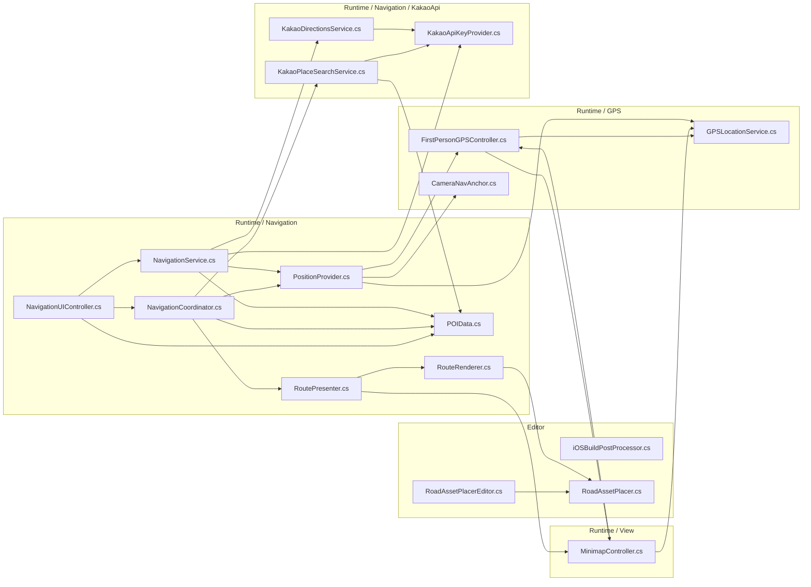

## 1. RoadTools C# 파일 내부 의존 관계 다이어그램
아래 다이어그램은 현재 `Assets/RoadTools` 아래의 `.cs` 파일만 대상으로 다시 계산했다. 화살표 방향은 "앞 파일이 뒤 파일의 타입을 참조한다"는 의미이며, Unity/Cesium/Kakao/Editor API 같은 외부 패키지 의존성은 제외했다.

### 1.1 파일별 내부 의존 목록

| C# 파일 | RoadTools 내부 의존 |
|---|---|
| `Assets/RoadTools/Editor/RoadAssetPlacerEditor.cs` | `RoadAssetPlacer.cs` |
| `Assets/RoadTools/Editor/iOSBuildPostProcessor.cs` | 없음 |
| `Assets/RoadTools/Editor/RoadAssetPlacer/RoadAssetPlacer.cs` | 없음 |
| `Assets/RoadTools/Runtime/GPS/GPSLocationService.cs` | 없음 |
| `Assets/RoadTools/Runtime/GPS/FirstPersonGPSController.cs` | `GPSLocationService.cs`, `MinimapController.cs` |
| `Assets/RoadTools/Runtime/GPS/CameraNavAnchor.cs` | 없음 |
| `Assets/RoadTools/Runtime/Navigation/NavigationUIController.cs` | `NavigationService.cs`, `NavigationCoordinator.cs`, `POIData.cs` |
| `Assets/RoadTools/Runtime/Navigation/NavigationCoordinator.cs` | `KakaoPlaceSearchService.cs`, `RoutePresenter.cs`, `PositionProvider.cs`, `POIData.cs` |
| `Assets/RoadTools/Runtime/Navigation/RoutePresenter.cs` | `RouteRenderer.cs`, `MinimapController.cs` |
| `Assets/RoadTools/Runtime/Navigation/PositionProvider.cs` | `GPSLocationService.cs`, `CameraNavAnchor.cs`, `FirstPersonGPSController.cs` |
| `Assets/RoadTools/Runtime/Navigation/NavigationService.cs` | `PositionProvider.cs`, `KakaoDirectionsService.cs`, `KakaoApiKeyProvider.cs`, `POIData.cs` |
| `Assets/RoadTools/Runtime/Navigation/RouteRenderer.cs` | `RoadAssetPlacer.cs` |
| `Assets/RoadTools/Runtime/Navigation/POIData.cs` | 없음 |
| `Assets/RoadTools/Runtime/Navigation/KakaoApi/KakaoApiKeyProvider.cs` | 없음 |
| `Assets/RoadTools/Runtime/Navigation/KakaoApi/KakaoDirectionsService.cs` | `KakaoApiKeyProvider.cs` |
| `Assets/RoadTools/Runtime/Navigation/KakaoApi/KakaoPlaceSearchService.cs` | `KakaoApiKeyProvider.cs`, `POIData.cs` |
| `Assets/RoadTools/Runtime/Minimap/MinimapController.cs` | `GPSLocationService.cs`, `FirstPersonGPSController.cs` |

### 1.2 내부 의존성 계산 요약

- 총 대상 파일: 17개
- 내부 의존이 없는 파일: `iOSBuildPostProcessor.cs`, `RoadAssetPlacer.cs`, `GPSLocationService.cs`, `CameraNavAnchor.cs`, `POIData.cs`, `KakaoApiKeyProvider.cs`
- `NavigationUIController.cs` 직접 의존은 7개에서 3개로 감소했다: `NavigationService.cs`, `NavigationCoordinator.cs`, `POIData.cs`
- `NavigationService.cs` 직접 의존은 6개에서 4개로 감소했다: `PositionProvider.cs`, `KakaoDirectionsService.cs`, `KakaoApiKeyProvider.cs`, `POIData.cs`
- 위치 관련 의존(`GPSLocationService.cs`, `CameraNavAnchor.cs`, `FirstPersonGPSController.cs`)은 `PositionProvider.cs`로 이동했다.
- `SearchProvider.cs`와 `BuildingLabelManager.cs`는 현재 `Assets/RoadTools` 아래에 존재하지 않는다.
- `RoadAssetPlacer.cs`는 현재 `Assets/RoadTools/Editor/RoadAssetPlacer/RoadAssetPlacer.cs`에 위치한다.
- `KakaoPlaceSearchService.cs`와 `KakaoDirectionsService.cs`는 `GPSLocationService.cs` 직접 의존을 제거하고, 위치/좌표 변환 값은 상위 계층에서 전달받는 구조로 바뀌었다.
- 순환 참조는 아직 남아 있다: `FirstPersonGPSController.cs`와 `MinimapController.cs`가 서로 참조한다.
